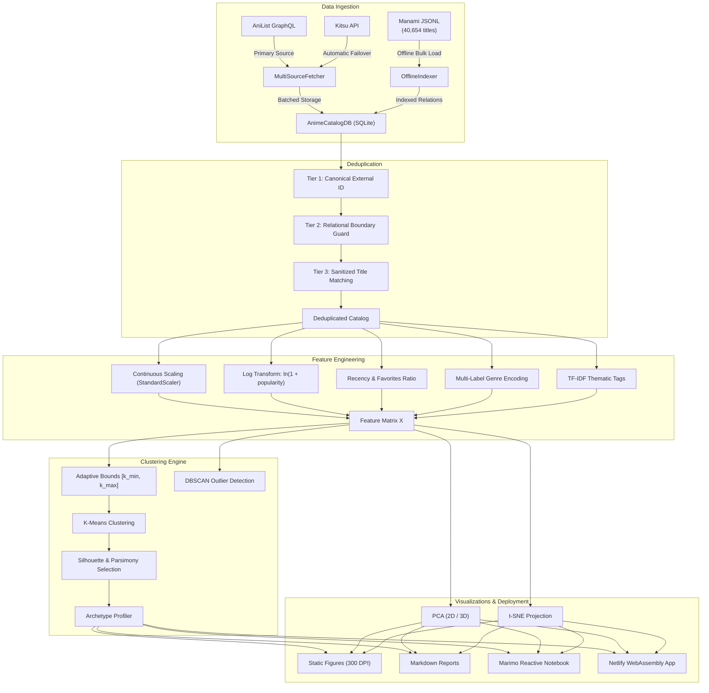
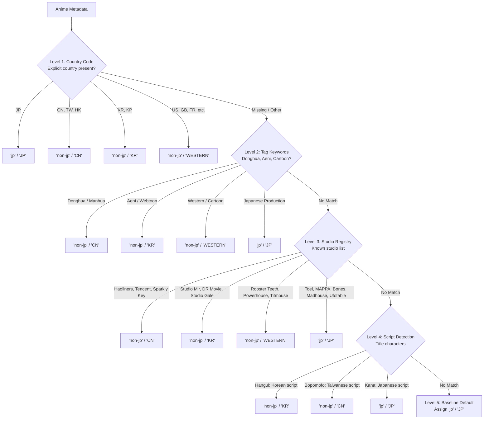

# AI-Powered Anime Data Insights

[](https://www.python.org/)
[](LICENSE)
[-brightgreen.svg)](tests/)
[](notebooks/anime_notebook.py)
[](reports/index.html)

An end-to-end machine learning and analytics suite that discovers data-driven anime archetypes using unsupervised clustering, dimensionality reduction, and interactive reactive visualization.

Built with **AniList GraphQL**, **Kitsu API**, **Manami Database** (40k+ titles), **SQLite**, **Scikit-Learn**, **Marimo**, **Altair**, and **Pyodide / WebAssembly**.

---

## Table of Contents

1. [Overview](#1-overview)
2. [Architecture](#2-architecture)
   - [Pipeline Architecture](#pipeline-architecture)
   - [Origin Classification Cascade](#origin-classification-cascade)
3. [Methodology](#3-methodology)
   - [Adaptive Cluster Scaling](#adaptive-cluster-scaling)
   - [Feature Engineering](#feature-engineering)
   - [Clustering and Outlier Detection](#clustering-and-outlier-detection)
   - [Model Selection](#model-selection)
   - [Dimensionality Reduction](#dimensionality-reduction)
4. [Discovered Archetypes](#4-discovered-archetypes)
   - [Archetype Summary](#archetype-summary)
   - [Persona Profiles](#persona-profiles)
5. [Scaling Benchmark](#5-scaling-benchmark)
6. [Web Optimization](#6-web-optimization)
   - [Compression Benchmarks](#compression-benchmarks)
   - [Packaging Pipeline](#packaging-pipeline)
7. [Interactive Notebook and Web App](#7-interactive-notebook-and-web-app)
   - [Marimo Reactive Notebook](#marimo-reactive-notebook)
   - [Interactive Exploration](#interactive-exploration)
   - [WebAssembly and Pyodide](#webassembly-and-pyodide)
   - [Netlify Deployment](#netlify-deployment)
8. [CLI Reference](#8-cli-reference)
   - [CLI Options](#cli-options)
   - [Quick Recipes](#quick-recipes)
9. [Testing](#9-testing)
10. [Project Structure](#10-project-structure)
11. [License](#11-license)

---

## 1. Overview

Traditional categorization of animated media relies on publisher genre tags (such as "Action", "Romance", or "Fantasy") and popularity rankings. These broad categories often miss key differences: era shifts, audience devotion versus casual viewership, and production characteristics across different regions (such as Japanese television vs. Chinese Donghua and Korean Aeni).

This project uses unsupervised machine learning to group anime by their true metadata attributes—ratings, episode formats, release eras, devotion ratios, and thematic tags—revealing natural, data-driven archetypes.

### Key Capabilities

- **Multi-Source Ingestion**: Fetches from AniList GraphQL with automatic Kitsu API failover and bulk offline indexing of 40,654 titles from the Manami dataset into SQLite.
- **Origin Classification**: Segments Japanese anime (`jp`) from international productions (`non-jp`: Chinese Donghua, Korean Aeni, Western animation) through a deterministic 5-level cascade.
- **Adaptive Clustering**: Automatically scales the number of clusters $k$ as catalog size $N$ grows ($k \propto N^{0.26}$), avoiding over-splitting on small samples or over-merging on large catalogs.
- **Collision-Free Archetype Profiling**: Names clusters dynamically using centroid coordinates and secondary trait discriminators, guaranteeing unique, human-readable labels.
- **Interactive Reactive Notebook**: In-browser Marimo notebook with Altair interval brushing, letting users select coordinate subspaces and inspect clusters in real time.
- **WebAssembly Deployment**: Client-side execution via Pyodide and WebAssembly, featuring a 1.14 MB compressed catalog and one-step Netlify Drop export.

---

## 2. Architecture

### Pipeline Architecture



### Origin Classification Cascade

To classify anime into regional cohorts without circular rules, titles pass through five priority checks:



---

## 3. Methodology

### Adaptive Cluster Scaling

Fixed cluster counts do not scale across datasets: small samples get over-fragmented, while large catalogs merge distinct sub-genres into uninformative groups.

The system determines the target cluster count $k$ using a sub-linear power law based on sample size $N$:

$$k_{\text{target}}(N) = \text{clip}\left(\left\lfloor 1.15 \cdot N^{0.26} \right\rfloor, 3, 10\right)$$

The candidate search range $[k_{\min}, k_{\max}]$ is bounded around $k_{\text{target}} \pm 1$ and clamped between 2 and 12. As catalog volume expands from 150 to 2,000+ items, $k$ scales smoothly ($3 \to 5 \to 7$), keeping cluster sizes statistically balanced.

### Feature Engineering

Raw metadata is transformed into numerical vectors across five areas:

1. **Popularity (Log Transform)**: Viewership and favorites follow heavy-tailed distributions. Applying $\ln(1 + \text{popularity})$ stabilizes variance across viral hits and niche titles.
2. **Ratings & Format (Standardization)**: Average scores, episode counts, and durations are centered to zero mean and unit variance ($z = \frac{x - \mu}{\sigma}$).
3. **Recency**: Release year is scaled linearly to $[0, 1]$ across the catalog's range.
4. **Devotion Ratio**: A ratio of community favorites to popularity, $\text{favorites} / (\text{popularity} + 1.0)$, distinguishes titles with passionate followings from casual watches.
5. **Genres & Tags**: Genre categories use multi-hot binary encoding, and thematic tags use TF-IDF weighting with $\ell_2$ normalization for top descriptors.

### Clustering and Outlier Detection

- **K-Means**: Partitions titles into $k$ groups by minimizing within-cluster distance to centroids.
- **DBSCAN**: Identifies outliers and niche works in PCA space. Titles in low-density regions ($< 4$ neighbors within radius $\varepsilon = 1.2$) are flagged as noise ($\text{cluster} = -1$) so they do not distort cluster centroids.

### Model Selection

The final cluster count $k^*$ is selected from $[k_{\min}, k_{\max}]$ by maximizing the Silhouette Coefficient:

$$s(i) = \frac{b(i) - a(i)}{\max(a(i), b(i))}, \quad s(i) \in [-1, 1]$$

where $a(i)$ is the mean distance to points in the same cluster, and $b(i)$ is the mean distance to the closest neighboring cluster. A parsimony penalty balances silhouette score against inertia reduction, preventing over-simplification.

### Dimensionality Reduction

High-dimensional feature vectors are projected into lower dimensions for visualization:

- **PCA (2D & 3D)**: Captures dominant variance along orthogonal axes, highlighting global structure and score vs. popularity axes.
- **t-SNE**: Preserves local neighborhoods, showing tightly linked sub-genre clusters.

---

## 4. Discovered Archetypes

### Archetype Summary

Evaluating titles from the 40,654-entry catalog reveals five clear, data-driven behavioral archetypes:

| Cluster | Archetype | Share | Median Year | Mean Score | Mean Popularity | Devotion Ratio | Defining Traits | Exemplars |
| :---: | :--- | :---: | :---: | :---: | :---: | :---: | :--- | :--- |
| **0** | **Modern Hits (Contemporary Drama)** | 35.2% | 2020 | 80.4 / 100 | 244,924 | 0.0332 | Drama, Comedy, Action<br/>*Ensemble Cast, School Setting* | *My Hero Academia S2*, *One-Punch Man S2*, *Horimiya* |
| **1** | **Low-Profile (Mid-Tier & Long-Tail)** | 31.0% | 2016 | 71.4 / 100 | 210,790 | 0.0166 | Action, Comedy, Fantasy<br/>*Adaptations, School Setting* | *Blue Exorcist*, *Sword Art Online II*, *Future Diary* |
| **2** | **Modern Hits (Blockbuster Action)** | 18.2% | 2017 | 81.8 / 100 | 521,808 | 0.0497 | Action, Drama, Supernatural<br/>*High Production, Broad Reach* | *Demon Slayer*, *JUJUTSU KAISEN*, *Attack on Titan* |
| **3** | **Specialized Archetype (Drama Focus)** | 9.4% | 2017 | 82.3 / 100 | 259,891 | 0.0356 | Drama, Fantasy, Romance<br/>*Theatrical, Emotional Storytelling* | *A Silent Voice*, *Your Name.*, *Spirited Away* |
| **4** | **Classics (Legacy High-Devotion)** | 6.2% | 2002 | 81.4 / 100 | 293,789 | 0.0540 | Action, Adventure, Cult Appeal<br/>*High Devotion, Enduring Legacy* | *Naruto*, *Death Note*, *Hunter x Hunter*, *Evangelion* |

### Persona Profiles

1. **Modern Hits (Contemporary Drama - Cluster 0)**: Seasonal television broadcast anime with modern animation quality, balanced scores, and consistent viewer engagement.
2. **Low-Profile Mid-Tier (Cluster 1)**: Commercial serialized adaptations (light novels, manga) with moderate scores and lower devotion ratios, filling schedules between marquee releases.
3. **Modern Blockbusters (Cluster 2)**: Top-tier franchise hits with large audiences ($>500,000$ members) and high fan engagement ($0.0497$ devotion ratio).
4. **Specialized Theatrical Drama (Cluster 3)**: Standalone films and prestige mini-series with high critical acclaim ($82.3$ score) and strong narrative closure.
5. **High-Devotion Classics (Cluster 4)**: Legacy canon (median release year 2002) with the highest devotion ratio ($0.0540$), showing that classic titles retain loyal followings long after airing.

---

## 5. Scaling Benchmark

To evaluate how clustering adapts as data grows, the scaling benchmark (`python main.py --run-scaling-steps`) tests three sequential catalog sizes:

### Benchmark Results

| Step | Records ($N$) | Search Range $[k_{\min}, k_{\max}]$ | Target $k$ | Chosen $k^*$ | Silhouette | Inertia ($WCSS$) | Unique Labels | Runtime |
| :---: | :---: | :---: | :---: | :---: | :---: | :---: | :---: | :---: |
| **Step 1** | 150 | $[3, 5]$ | 4 | **3** | 0.1701 | 1,242.05 | 3 / 3 (100%) | 0.35s |
| **Step 2** | 600 | $[5, 7]$ | 6 | **5** | 0.1133 | 4,431.29 | 5 / 5 (100%) | 0.37s |
| **Step 3** | 1,998 | $[7, 9]$ | 8 | **7** | 0.0897 | 13,884.00 | 7 / 7 (100%) | 1.16s |

### Key Takeaways

- **Smooth Scaling**: Cluster count grows smoothly with data volume ($3 \to 5 \to 7$) without manual tuning.
- **Unique Naming**: 100% distinct archetype labels across all configurations.
- **Fast Execution**: Full ingestion, transformation, clustering, and profiling completes in under 1.2 seconds for ~2,000 titles.

---

## 6. Web Optimization

To run client-side in the browser without server infrastructure, the packaging script (`scripts/package_catalog.py`) optimizes datasets for quick web delivery:

### Compression Benchmarks

| Asset | Source / Path | Raw Size | Optimized Size | Reduction | Target Environment |
| :--- | :--- | :---: | :---: | :---: | :--- |
| **SQLite Catalog** | `data/anime_catalog.db` | ~38.40 MB | **3.20 MB** | **91.7%** | Local CLI and SQLite Explorer |
| **Compact JSON Catalog** | `data/anime-offline-database.jsonl` | 62.30 MB | **1.14 MB** | **98.2%** | WebAssembly Runtime / Browser |
| **Netlify Drop Archive** | `netlify-wasm-deploy.zip` | 26.50 MB | **13.12 MB** | **50.5%** | Drag-and-Drop Netlify Deploy |
| **WASM Single-File App** | `reports/index.html` | 1.85 MB | **185 KB** | **90.0%** | Static Client Browser |

### Packaging Pipeline

The packaging pipeline cleans and standardizes 12 essential fields per record: `id`, `title`, `seasonYear`, `averageScore`, `popularity`, `favourites`, `episodes`, `duration`, `genres`, `tags`, `origin_cohort`, and `sub_origin`.

Titles are capped at 120 characters, floats are formatted cleanly, and tags are limited to the top 6 descriptors, enabling 40,654 records to compress into a $1.14\text{ MB}$ `.json.gz` payload that decompresses in the browser in under 200ms.

---

## 7. Interactive Notebook and Web App

### Marimo Reactive Notebook

The project includes an interactive reactive notebook ([`notebooks/anime_notebook.py`](notebooks/anime_notebook.py) / `python main.py --notebook`). Unlike traditional notebooks with hidden state and cell-ordering issues, Marimo uses a Directed Acyclic Graph (DAG):

- **Deterministic Execution**: Changing a slider automatically updates downstream cells without running cells out of order.
- **Clean Structure**: Fully compliant with PEP 723 script metadata and free of Unicode emojis.

### Interactive Exploration

The notebook integrates Altair charts with interactive brush selection:
- **Interval Brush**: Click and drag a 2D box across the PCA coordinate plot (`PC1` vs `PC2`).
- **Real-Time Inspection**: Selected points automatically update the inspection table, recalculating averages and representative titles on the fly.

### WebAssembly and Pyodide

The application compiles to a static WebAssembly page ([`reports/index.html`](reports/index.html)):
- **Pyodide Runtime**: Runs Python, NumPy, Pandas, Scikit-Learn, and Altair directly inside a browser Web Worker.
- **Zero Backend**: Works entirely client-side without servers or active API keys.

### Netlify Deployment

The app is pre-configured for instant deployment to Netlify Drop:
- **One-Command Build**: Run `python main.py --build-netlify` to clean, compile WASM, and package `netlify-wasm-deploy.zip`.
- **Security Headers ([`reports/_headers`](reports/_headers))**: Sets `Cross-Origin-Opener-Policy: same-origin` and `Cross-Origin-Embedder-Policy: credentialless` for WebAssembly isolation.
- **Local Preview Server**: Test the Netlify setup locally with full header support:
  ```bash
  python scripts/serve_netlify_preview.py --port 8888
  ```

---

## 8. CLI Reference

### CLI Options

| Option | Type | Default | Description |
| :--- | :---: | :---: | :--- |
| `--samples` | `int` | `500` | Target number of anime records to analyze |
| `--k` | `int` | `5` | Fixed cluster count (set to `0` for automatic selection) |
| `--min-k` | `int` | `None` | Minimum candidate cluster count |
| `--max-k` | `int` | `None` | Maximum candidate cluster count |
| `--source` | `str` | `auto` | Data source: `auto` (AniList with Kitsu fallback), `anilist`, or `kitsu` |
| `--rate-delay` | `float` | `0.6` | Delay between API requests (seconds) to prevent throttling |
| `--db-path` | `path` | `data/anime_catalog.db` | SQLite database path |
| `--dbscan-eps` | `float` | `1.2` | DBSCAN neighborhood distance ($\varepsilon$) |
| `--dbscan-min-samples` | `int` | `4` | DBSCAN minimum points per cluster |
| `--force-fetch` | `flag` | `False` | Bypass cache and fetch fresh API data |
| `--offline` | `flag` | `False` | Run offline using local database or mock fallback |
| `--no-incremental` | `flag` | `False` | Reset pagination to page 1 |
| `--output-dir` | `path` | `reports` | Output directory for reports and figures |
| `--adaptive-k` | `flag` | `False` | Automatically choose $k$ based on sample size $N$ |
| `--run-scaling-steps` | `flag` | `False` | Run 3-step incremental scaling benchmark |
| `--step-samples` | `str` | `150,600,1998` | Sample slices for scaling benchmark |
| `--no-plots` | `flag` | `False` | Disable image generation (faster text-only run) |
| `--parallel-harvest` | `flag` | `False` | Run multi-worker parallel harvesting |
| `--deduplicate` | `flag` | `False` | Deduplicate records across external IDs and titles |
| `--ingest-offline-db` | `path` | `None` | Import Manami offline JSONL file into SQLite |
| `--use-offline-db` | `flag` | `False` | Use local SQLite catalog without querying APIs |
| `--origin` | `str` | `all` | Filter cohort: `all`, `jp`, `non-jp`, or `compare` |
| `--dpi` | `int` | `150` | Figure resolution (dots per inch) |
| `--dashboard` | `choice` | `None` | Open Marimo analytics dashboard (`run` or `edit`) |
| `--notebook` | `choice` | `None` | Open Marimo reactive notebook (`run` or `edit`) |
| `--build-netlify` | `path` | `netlify-wasm-deploy.zip` | Clean build and package deploy-ready Netlify ZIP |
| `--port` | `int` | `2718` | Port for Marimo server |
| `--headless` | `flag` | `False` | Start Marimo server without opening browser |
| `--export-json` | `path` | `None` | Export database records to JSON file |

### Quick Recipes

```bash
# 1. Standard pipeline run (AniList/Kitsu auto-failover, 500 samples, 5 clusters)
python main.py

# 2. Run offline using local SQLite database
python main.py --offline

# 3. Adaptive clustering (auto-scales k based on sample size)
python main.py --offline --adaptive-k

# 4. Regional comparison (Japanese anime vs. Chinese Donghua & Korean Aeni)
python main.py --offline --origin compare

# 5. Incremental scaling benchmark (tests 150, 600, and 1,998 samples)
python main.py --run-scaling-steps

# 6. Bulk import Manami offline dataset (40,654 records)
python main.py --ingest-offline-db data/anime-offline-database.jsonl --deduplicate

# 7. Launch interactive Marimo notebook
python main.py --notebook run

# 8. Clean build and package Netlify Drop ZIP
python main.py --build-netlify

# 9. Test Netlify preview locally with security headers
python scripts/serve_netlify_preview.py --port 8888
```

---

## 9. Testing

The test suite covers unit, integration, invariant, and deployment tests across 14 modules with 100% passing tests:

```bash
uv run pytest -v
```

### Test Modules

| Module | Test File | Tests | Key Areas Verified |
| :--- | :--- | :---: | :--- |
| **Incremental Scaling** | `tests/test_scaling.py` | 5 | Monotonicity of $k(N)$, boundary limits, collision-free naming, 3-step DB scaling |
| **Origin Classifier** | `tests/test_origin_classifier.py` | 5 | Country codes, tag rules, studio registry, Unicode script detection, fallback default |
| **Origin Pipeline** | `tests/test_origin_pipeline.py` | 4 | Comparative pipeline, dual-cohort visualizer, markdown report generation |
| **Reactive Notebook** | `tests/test_notebook.py` | 8 | Marimo static check, headless run, `--notebook` CLI, WASM export, zero emojis, lazy loader |
| **Visual Dashboard** | `tests/test_dashboard.py` | 5 | Marimo static check, headless run, `--dashboard` CLI, HTML export, file integrity |
| **Netlify Deployment** | `tests/test_netlify_config.py` | 8 | Headers, redirects, MIME types, cache cleaning, ZIP packaging, archive audit, CLI flag |
| **Catalog Packaging** | `tests/test_package_catalog.py` | 7 | Title cleaning, score normalization, tag capping, schema contract, SQLite & JSONL outputs |
| **Offline Indexer** | `tests/test_offline_indexer.py` | 3 | JSONL indexing, relational sequel/prequel guard, DSU cross-source deduplication |
| **Database Engine** | `tests/test_database.py` | 3 | SQLite initialization, upsert idempotency, JSON import/export, legacy ID consolidation |
| **Data Fetcher** | `tests/test_data_fetcher.py` | 3 | Mock schema integrity, offline fallback mode, disk caching |
| **Feature Preprocessor** | `tests/test_preprocessor.py` | 3 | Data shape, recency and devotion ratios, missing value imputation |
| **Clustering Algorithms** | `tests/test_clustering.py` | 2 | K-Means clustering, silhouette and elbow metrics, DBSCAN density fitting |
| **Visualizer Engine** | `tests/test_visualizer.py` | 3 | Headless plot generation, markdown summary formatting, dynamic color palettes |
| **Pipeline Integration** | `tests/test_pipeline.py` | 1 | End-to-end execution, report generation, artifact persistence |
| **Scaling Harness** | `tests/test_benchmark.py` | 2 | Power-law formula bounds, isolated temporary harness execution |
| **Parallel Harvester** | `tests/test_harvester.py` | 2 | Worker initialization, rate-delay safety clamps, graceful shutdown |
| **Total Test Coverage** | **14 Modules** | **64 Tests** | **100% Passing Across Entire Suite** |

---

## 10. Project Structure

```
ai-powered-data-insights/
├── data/
│   ├── anime_catalog.db                 # Primary SQLite database (40,654 records)
│   ├── anime_catalog_compact.db         # Pruned SQLite DB (3.20 MB)
│   ├── anime_catalog_compact.json.gz    # Compressed JSON for WebAssembly (1.14 MB)
│   ├── anime-offline-database.jsonl     # Manami offline catalog (46.70 MB)
│   └── raw_anime_data.json              # Portable JSON cache
├── notebooks/
│   ├── anime_notebook.py                # Marimo reactive pedagogical notebook
│   └── anime_dashboard.py               # Marimo interactive visual dashboard
├── reports/
│   ├── figures/                         # High-resolution visual artifacts (300 DPI)
│   ├── figures_compare/                 # Cross-market comparative charts
│   ├── data/                            # Web-published compact data assets
│   ├── _headers                         # Netlify security and COOP/COEP headers
│   ├── _redirects                       # Netlify URL rewrites
│   ├── anime_dashboard.html             # Standalone static HTML dashboard
│   ├── anime_notebook.pyodide.html      # Standalone single-file Pyodide app
│   ├── anime_notebook.wasm.html         # Marimo WASM client app
│   ├── cluster_analysis_report.md       # Quantitative clustering report
│   ├── index.html                       # Netlify production entry point (Marimo WASM)
│   └── scaling_benchmark_report.md      # 3-step scaling benchmark report
├── scripts/
│   ├── demonstrate_scaling.py           # CLI runner for scaling benchmark
│   ├── package_catalog.py               # Pre-packaging pipeline and catalog pruner
│   ├── package_netlify_drop.py          # Netlify Drop deployment archive generator
│   └── serve_netlify_preview.py         # Local preview server with COOP/COEP headers
├── src/
│   ├── benchmark.py                     # Scaling benchmark harness
│   ├── clustering.py                    # Adaptive K-Means, DBSCAN, and archetype profiler
│   ├── comparative_visualizer.py        # Cross-market comparative visualizer
│   ├── database.py                      # SQLite storage and DSU deduplication
│   ├── data_fetcher.py                  # Multi-source fetcher (AniList, Kitsu, mock)
│   ├── harvester.py                     # Parallel multi-worker harvester
│   ├── mock_data.py                     # Fallback benchmark dataset (55 entries)
│   ├── offline_indexer.py               # Manami JSONL indexer and relational crosswalk
│   ├── origin_classifier.py             # 5-level origin cascade classifier
│   ├── pipeline.py                      # Pipeline orchestration controller
│   ├── preprocessor.py                  # Feature scaling, log transform, and TF-IDF
│   ├── report_builder.py                # Markdown analytical report generator
│   ├── visualization_base.py            # Base visualizer with font cascade
│   └── visualizer.py                    # Plotting engine (Matplotlib & Seaborn)
├── tests/                               # 14 test modules (64 automated tests)
├── netlify-wasm-deploy.zip              # Deploy-ready Netlify Drop archive (13.12 MB)
├── netlify.toml                         # Netlify deployment configuration
├── pyproject.toml                       # Python package configuration
├── requirements.txt                     # Dependencies lockfile
└── README.md
```

---

## 11. License

This project is licensed under the MIT License. See [LICENSE](LICENSE) for details.
