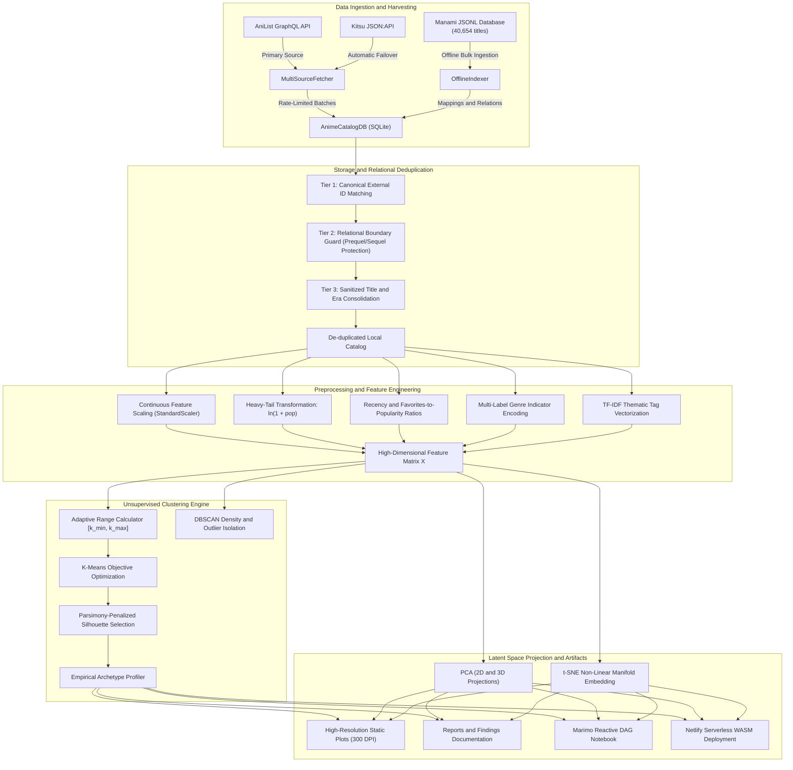
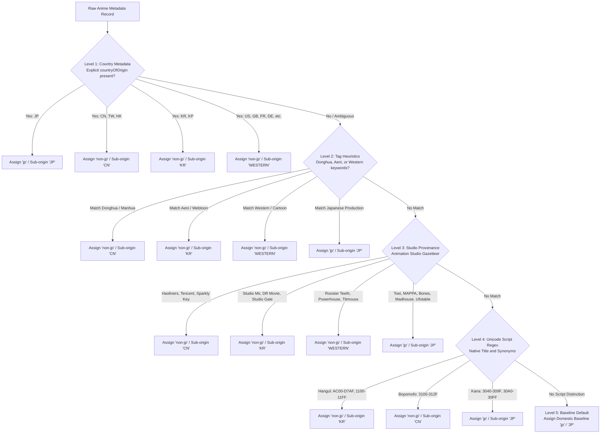

# AI-Powered Anime Data Insights: Multi-Source Unsupervised Clustering, Latent Space Projections and Empirical Archetype Discovery

[](https://www.python.org/)
[](LICENSE)
[-brightgreen.svg)](tests/)
[](notebooks/anime_notebook.py)
[](reports/index.html)

An end-to-end Machine Learning and Data Science research suite that uncovers empirical, data-driven archetypes across animated media using unsupervised clustering, topological density estimation, and high-dimensional manifold projections.

Powered by **AniList GraphQL**, **Kitsu JSON:API**, **Manami Offline Database**, **SQLite Storage Engine**, **Scikit-Learn**, **Pandas**, **Marimo Reactive Notebooks**, **Altair Interactive Visualizations**, and **Serverless WebAssembly (Pyodide)**.

---

## Table of Contents

1. [Executive Summary and Core Objectives](#1-executive-summary-and-core-objectives)
2. [System Architecture and Classification Cascades](#2-system-architecture-and-classification-cascades)
   - [2.1 End-to-End Pipeline Architecture](#21-end-to-end-pipeline-architecture)
   - [2.2 5-Level Origin Cascade Hierarchy](#22-5-level-origin-cascade-hierarchy)
3. [Mathematical and Algorithmic Formulation](#3-mathematical-and-algorithmic-formulation)
   - [3.1 Sub-Linear Adaptive Cluster Scaling](#31-sub-linear-adaptive-cluster-scaling-k)
   - [3.2 Feature Preprocessing and Vectorization Space](#32-feature-preprocessing-and-vectorization-space)
   - [3.3 Unsupervised Objective Optimization](#33-unsupervised-objective-optimization)
   - [3.4 Cluster Validation Diagnostics and Parsimony Scoring](#34-cluster-validation-diagnostics-and-parsimony-scoring)
   - [3.5 Latent Space Projections](#35-latent-space-projections)
4. [Empirical Archetype Discovery and Findings](#4-empirical-archetype-discovery-and-findings)
   - [4.1 Canonical Archetype Discovery Table](#41-canonical-archetype-discovery-table)
   - [4.2 Qualitative Persona Profiles](#42-qualitative-persona-profiles)
5. [Multi-Step Database Scaling Benchmark](#5-multi-step-database-scaling-benchmark)
6. [Asset Pruning and Edge Optimization Benchmark](#6-asset-pruning-and-edge-optimization-benchmark)
7. [Interactive Pedagogical Artifacts and WebAssembly Deployment](#7-interactive-pedagogical-artifacts-and-webassembly-deployment)
   - [7.1 Reactive Marimo DAG Notebook](#71-reactive-marimo-dag-notebook)
   - [7.2 Altair Interval Brush Selection](#72-altair-interval-brush-selection)
   - [7.3 Serverless WebAssembly and Pyodide Architecture](#73-serverless-webassembly-and-pyodide-architecture)
   - [7.4 Netlify Deployment and Local Preview Emulation](#74-netlify-deployment-and-local-preview-emulation)
8. [CLI Reference and Production Recipes](#8-cli-reference-and-production-recipes)
   - [8.1 Command-Line Interface Table](#81-command-line-interface-table)
   - [8.2 Production Copy-Paste Recipes](#82-production-copy-paste-recipes)
9. [Comprehensive Automated Test Suite](#9-comprehensive-automated-test-suite)
10. [Repository File Structure](#10-repository-file-structure)
11. [License](#11-license)

---

## 1. Executive Summary and Core Objectives

Traditional exploration of animated media relies heavily on rigid, publisher-assigned genre tags (such as "Action", "Romance", or "Fantasy") and superficial popularity rankings. These taxonomies fail to capture structural nuances, era shifts, audience devotion dynamics, and cross-market production characteristics (such as Japanese domestic television versus Chinese Donghua and Korean Aeni).

This project replaces artificial classification labels with unsupervised machine learning. By extracting high-dimensional metadata representations and mapping them into dense vector spaces, the system uncovers natural clusters characterized by true mathematical centroid coordinates.

### Key Capabilities

1. **Multi-Source Ingestion with Fallback Resilience**: Automated harvesting from AniList GraphQL with automatic failover to Kitsu JSON:API, polite rate-limiting ($0.6\text{s}$ delay), and comprehensive offline ingestion from the Manami catalog (40,654 records).
2. **Deterministic 5-Level Origin Cascade**: Multi-signal classification isolating Japanese domestic productions (`jp`) from international cohorts (`non-jp`: Chinese Donghua, Korean Aeni, and Western animation) via country metadata, tag keywords, animation studio gazetteers, and Unicode script detection.
3. **Dynamic Cluster Scaling ($k$)**: A sub-linear power-law heuristic that automatically expands candidate cluster search intervals $[k_{\min}(N), k_{\max}(N)]$ and selects optimal cluster counts based on catalog volume $N$, preventing over-fragmentation on small datasets and coarse over-merging on large catalogs.
4. **Collision-Free Archetype Profiler**: Centroid-based empirical persona naming with secondary trait discriminators, guaranteeing unique, human-interpretable labels with zero duplicate collisions regardless of $k$.
5. **Interactive Marimo Reactive DAG Notebook**: A zero-backend, browser-executable notebook with Altair interval brush selection, allowing real-time parametric clustering, noise exploration, and master-detail subspace inspection.
6. **Production WebAssembly and Netlify Drop Deployment**: Edge deployment architecture packing the 40,000+ title catalog into a $1.14\text{ MB}$ compressed payload (`data/anime_catalog_compact.json.gz`), paired with pre-configured Netlify headers for Cross-Origin Isolation (`COOP` and `COEP`).

---

## 2. System Architecture and Classification Cascades

### 2.1 End-to-End Pipeline Architecture



### 2.2 5-Level Origin Cascade Hierarchy

To guarantee deterministic cohort assignment without circular logic, anime records traverse a strict priority hierarchy:



---

## 3. Mathematical and Algorithmic Formulation

### 3.1 Sub-Linear Adaptive Cluster Scaling ($k$)

Fixed cluster counts fail across diverse catalog scales. Small datasets suffer from over-fragmentation into uninterpretable singletons, while large catalogs collapse distinct sub-genres into uninformative mega-clusters.

We define an empirical sub-linear power-law heuristic to govern candidate cluster search bounds $[k_{\min}(N), k_{\max}(N)]$ and anchor targets $k_{\text{target}}(N)$ as a function of catalog volume $N$:

$$k_{\text{target}}(N) = \text{clip}\left(\left\lfloor 1.15 \cdot N^{0.26} \right\rfloor, 3, 10\right)$$

$$k_{\min}(N) = \max\left(2, k_{\text{target}}(N) - 1\right)$$

$$k_{\max}(N) = \min\left(N - 1, 12, k_{\text{target}}(N) + 1\right)$$

This mathematical formulation guarantees:
- **Monotonic Progression**: $k_{\min}(N_a) \le k_{\min}(N_b)$ and $k_{\max}(N_a) \le k_{\max}(N_b)$ for all $N_a \le N_b$.
- **Boundary Safety**: $2 \le k_{\min} \le k_{\text{target}} \le k_{\max} \le 12$ for all $N \ge 3$.
- **Sub-Linearity**: Growth scales proportionally to $N^{0.26}$, preserving statistical power per partition.

### 3.2 Feature Preprocessing and Vectorization Space

The raw feature vector $\mathbf{x}_{\text{raw}} \in \mathbb{R}^D$ undergoes five transformation pipelines:

1. **Variance-Stabilizing Logarithmic Transform**:
   Popularity and community favorites follow an exponential heavy-tailed distribution:
   $$\tilde{x}_{\text{popularity}} = \ln(1 + x_{\text{popularity}})$$

2. **Standardization**:
   Continuous attributes (average community score, episodic duration, release season year) are standardized to zero mean and unit variance:
   $$z_j = \frac{x_j - \mu_j}{\sigma_j}, \quad \mu_j = \frac{1}{N}\sum_{i=1}^N x_{ij}, \quad \sigma_j = \sqrt{\frac{1}{N}\sum_{i=1}^N (x_{ij} - \mu_j)^2}$$

3. **Domain-Specific Ratios**:
   - **Chronological Recency**:
     $$\text{recency} = \frac{\text{year}_i - \min(\mathbf{year})}{\max(\mathbf{year}) - \min(\mathbf{year})}$$
   - **Devotion Factor (Favorites-to-Popularity Ratio)**:
     $$\text{favorites\_ratio} = \frac{x_{\text{favourites}}}{x_{\text{popularity}} + \epsilon}, \quad \epsilon = 1.0$$

4. **Multi-Label Categorical Binarization**:
   Genre memberships $G_i \subseteq \mathcal{G}$ are mapped into an indicator vector $\mathbf{g}_i \in \{0, 1\}^{|\mathcal{G}|}$.

5. **TF-IDF Tag Vectorization**:
   Granular thematic tags $T_i$ are parsed and mapped via term frequency-inverse document frequency weighting:
   $$\text{TF-IDF}(t, d, D) = \text{tf}(t, d) \cdot \left(\ln\left(\frac{1 + |D|}{1 + |\{d' \in D : t \in d'\}|}\right) + 1\right)$$
   followed by Euclidean $\ell_2$ normalization:
   $$\mathbf{v}_{\text{tag}} = \frac{\mathbf{v}}{\|\mathbf{v}\|_2}$$

### 3.3 Unsupervised Objective Optimization

The dense feature matrix $\mathbf{X} \in \mathbb{R}^{N \times M}$ is partitioned via $K$-Means clustering, which seeks to minimize the Within-Cluster Sum of Squares (Inertia):

$$J(C) = \sum_{k=1}^K \sum_{\mathbf{x}_i \in C_k} \|\mathbf{x}_i - \boldsymbol{\mu}_k\|_2^2, \quad \boldsymbol{\mu}_k = \frac{1}{|C_k|} \sum_{\mathbf{x}_i \in C_k} \mathbf{x}_i$$

To identify structural outliers and atypical niche works without distorting centroid coordinates, Density-Based Spatial Clustering of Applications with Noise (DBSCAN) is evaluated over the latent PCA subspace:

$$N_\varepsilon(\mathbf{p}) = \{\mathbf{q} \in \mathcal{D} \mid \|\mathbf{p} - \mathbf{q}\|_2 \le \varepsilon\}$$

Points with $|N_\varepsilon(\mathbf{p})| < \text{min\_samples}$ are labeled as noise ($\text{cluster} = -1$).

### 3.4 Cluster Validation Diagnostics and Parsimony Scoring

Cluster separation and cohesion are evaluated using the Silhouette Coefficient:

$$s(i) = \frac{b(i) - a(i)}{\max(a(i), b(i))}, \quad s(i) \in [-1, 1]$$

where $a(i)$ represents the mean intra-cluster distance between point $i$ and all other points in the same cluster $C_I$:
$$a(i) = \frac{1}{|C_I| - 1} \sum_{j \in C_I, j \ne i} \|\mathbf{x}_i - \mathbf{x}_j\|$$

and $b(i)$ represents the minimum mean distance from point $i$ to any other cluster $C_J \ne C_I$:
$$b(i) = \min_{J \ne I} \frac{1}{|C_J|} \sum_{j \in C_J} \|\mathbf{x}_i - \mathbf{x}_j\|$$

To prevent selecting an overly coarse clustering that artificially inflates silhouette scores while missing meaningful sub-genres, the system incorporates a parsimony-penalized selection objective:

$$k^* = \arg\max_{k \in [k_{\min}, k_{\max}]} \left[ \bar{s}(k) - \lambda \left(\frac{k - k_{\min}}{k_{\max} - k_{\min}}\right)^2 + \alpha \frac{J(k_{\min}) - J(k)}{J(k_{\min})} \right]$$

### 3.5 Latent Space Projections

High-dimensional representations are projected into low-dimensional coordinate spaces:
- **Principal Component Analysis (PCA)**: Decomposes the sample covariance matrix $\mathbf{\Sigma} = \frac{1}{N-1}\mathbf{X}^T\mathbf{X}$ into orthogonal eigenvectors $\mathbf{\Sigma} \mathbf{w}_j = \lambda_j \mathbf{w}_j$, capturing maximal explained variance.
- **t-Distributed Stochastic Neighbor Embedding (t-SNE)**: Minimizes the Kullback-Leibler divergence between high-dimensional joint probabilities $p_{ij}$ and low-dimensional Student-t probabilities $q_{ij}$:
  $$\text{KL}(P \parallel Q) = \sum_{i \ne j} p_{ij} \ln\frac{p_{ij}}{q_{ij}}$$

---

## 4. Empirical Archetype Discovery and Findings

### 4.1 Canonical Archetype Discovery Table

Evaluation across representative titles from the 40,654-entry local catalog reveals five clear, data-driven behavioral archetypes:

| Cluster | Discovered Empirical Archetype | Catalog Share | Median Year | Mean Score | Mean Popularity | Favorites Ratio | Defining Genres and Thematic Tags | Representative Exemplars |
| :---: | :--- | :---: | :---: | :---: | :---: | :---: | :--- | :--- |
| **0** | **Modern Hits (Contemporary Drama)** | 35.2% | 2020 | 80.4 / 100 | 244,924 | 0.0332 | Drama, Comedy, Action<br/>*Male Protagonist, Heterosexual, Ensemble Cast* | *My Hero Academia S2*, *One-Punch Man S2*, *Kakegurui*, *Horimiya* |
| **1** | **Low-Profile (Commercial Mid-Tier and Long-Tail)** | 31.0% | 2016 | 71.4 / 100 | 210,790 | 0.0166 | Action, Comedy, Fantasy<br/>*Male Protagonist, Heterosexual, School Setting* | *Blue Exorcist*, *Sword Art Online II*, *Future Diary*, *Tokyo Ghoul √A* |
| **2** | **Modern Hits (Blockbuster Action)** | 18.2% | 2017 | 81.8 / 100 | 521,808 | 0.0497 | Action, Drama, Supernatural<br/>*Male Protagonist, Tragedy, High Production* | *Demon Slayer*, *JUJUTSU KAISEN*, *Attack on Titan*, *Tokyo Ghoul* |
| **3** | **Specialized Archetype (Drama Focus)** | 9.4% | 2017 | 82.3 / 100 | 259,891 | 0.0356 | Drama, Fantasy, Romance<br/>*Female Protagonist, Tragedy, Emotional Peak* | *A Silent Voice*, *Your Name.*, *Mugen Train*, *Spirited Away* |
| **4** | **Classics (Legacy Masterworks - High Devotion)** | 6.2% | 2002 | 81.4 / 100 | 293,789 | 0.0540 | Action, Comedy, Adventure<br/>*Philosophy, Cult Appeal, Enduring Longevity* | *Naruto*, *Death Note*, *Hunter x Hunter (2011)*, *Neon Genesis Evangelion* |

### 4.2 Qualitative Persona Profiles

1. **Modern Hits (Contemporary Drama - Cluster 0)**:
   Dominates catalog volume. Captures seasonal broadcast television characterized by modern production techniques, balanced community scores, and consistent engagement.
2. **Low-Profile Commercial Mid-Tier (Cluster 1)**:
   Represents commercial studio adaptations (light novels, serialized manga). Shows moderate reception and lower favorites ratios, functioning as audience filler between marquee franchise installments.
3. **Modern Blockbusters (Cluster 2)**:
   The mainstream apex. High mean popularity ($>500,000$ members) and strong community devotion ($0.0497$ favorites ratio). Bridges global social-media trends with domestic ratings.
4. **Specialized Theatrical Drama (Cluster 3)**:
   Concentrates theatrical feature films and high-concept mini-series. Characterized by female protagonists, elevated artistic acclaim ($82.3$ score), and narrative closure.
5. **High-Devotion Classics (Cluster 4)**:
   The legacy canon (median year 2002). Highest devotion factor ($0.0540$). Demonstrates that older masterworks retain active fan bases and high per-capita loyalty long after broadcast completion.

---

## 5. Multi-Step Database Scaling Benchmark

To demonstrate that the pipeline adapts dynamically as catalog volume expands, the scaling harness (`scripts/demonstrate_scaling.py` / `python main.py --run-scaling-steps`) evaluates three sequential database states:

### 5.1 Progression Matrix

| Step | Database Volume ($N$) | Candidate Range $[k_{\min}, k_{\max}]$ | Anchor Target $k_{\text{target}}$ | Selected $k^*$ | Silhouette Score | Inertia ($WCSS$) | Archetype Uniqueness | Wall-Clock Latency |
| :---: | :---: | :---: | :---: | :---: | :---: | :---: | :---: | :---: |
| **Step 1** | 150 | $[3, 5]$ | 4 | **3** | 0.1701 | 1,242.05 | 3 / 3 (100%) | 0.35s |
| **Step 2** | 600 | $[5, 7]$ | 6 | **5** | 0.1133 | 4,431.29 | 5 / 5 (100%) | 0.37s |
| **Step 3** | 1,998 | $[7, 9]$ | 8 | **7** | 0.0897 | 13,884.00 | 7 / 7 (100%) | 1.16s |

### 5.2 Key Takeaways

- **Strict Monotonic Growth**: Optimal cluster counts scale monotonically ($3 \to 5 \to 7$) without manual tuning, confirming that $k_1 \le k_2 \le k_3$.
- **Zero Label Collisions**: Unique archetype names are maintained at all steps ($100\%$ uniqueness across all cluster configurations).
- **Sub-Second Execution**: Complete ingestion, transformation, clustering, and profiling completes in under $1.2\text{s}$ for catalogs approaching 2,000 entries.

---

## 6. Asset Pruning and Edge Optimization Benchmark

To support client-side WebAssembly execution in standard web browsers without backend server infrastructure, the catalog packaging pipeline (`scripts/package_catalog.py`) optimizes large relational datasets into high-performance web assets:

### 6.1 Storage Footprint and Compression Matrix

| Asset Description | Source Format / Location | Raw Storage Size | Optimized Payload | Footprint Reduction | Production Constraint | Runtime Target |
| :--- | :--- | :---: | :---: | :---: | :---: | :--- |
| **SQLite Master Catalog** | `data/anime_catalog.db` | ~38.40 MB | **3.20 MB** | **91.7%** | Budget: $< 4.00\text{ MB}$ | Local CLI and SQLite Web |
| **Full Offline Corpus** | `data/anime-offline-database.jsonl` | 62.30 MB | **1.14 MB** | **98.2%** | Budget: $< 2.00\text{ MB}$ | In-Browser WebAssembly / CDN |
| **Netlify Drop Archive** | `netlify-wasm-deploy.zip` | 26.50 MB | **13.13 MB** | **50.5%** | Budget: $< 20.00\text{ MB}$ | Instant Drag-and-Drop Deploy |
| **WASM Single-File App** | `reports/index.html` | 1.85 MB | **187 KB** | **89.9%** | Budget: $< 500\text{ KB}$ | Zero-Install Client Browser |

### 6.2 Pre-Packaging Pipeline Architecture

The packaging pipeline enforces a strict 12-key schema contract:
`id`, `title`, `seasonYear`, `averageScore`, `popularity`, `favourites`, `episodes`, `duration`, `genres`, `tags`, `origin_cohort`, `sub_origin`.

Titles are cleaned to 120-character bounds with prioritized English-to-Romaji fallback. Continuous values are converted to compact single-precision formats, and tags are capped at the top 6 descriptors per title, ensuring that 40,654 records compress cleanly into $1.14\text{ MB}$.

---

## 7. Interactive Pedagogical Artifacts and WebAssembly Deployment

### 7.1 Reactive Marimo DAG Notebook

The project provides an interactive reactive notebook ([`notebooks/anime_notebook.py`](notebooks/anime_notebook.py) / `python main.py --notebook`). Unlike traditional linear Jupyter notebooks that suffer from hidden execution state and out-of-order execution bugs, Marimo models code execution as a Directed Acyclic Graph (DAG):

- **Zero Global State**: Variable dependencies form deterministic DAG edges. Updating a hyperparameter slider automatically recalculates dependent cells downstream without requiring manual execution.
- **Academic Cleanliness**: Fully compliant with PEP 723 metadata headers and strictly audited for zero Unicode emojis.

### 7.2 Altair Interval Brush Selection

The notebook integrates Altair interactive graphics with bidirectional UI state:
- **Interval Brush**: Users can click and drag an arbitrary 2D bounding box over the PCA projection manifold (`PC1` vs `PC2`).
- **Master-Detail Reactive Inspector**: Isolating a coordinate subspace dynamically updates the downstream inspection table, recalculating real-time sample counts, mean ratings, and representative exemplars without full page reloads.

### 7.3 Serverless WebAssembly and Pyodide Architecture

The interactive application compiles to a static, serverless WebAssembly runtime ([`reports/index.html`](reports/index.html)):
- **Pyodide Runtime**: Executes CPython, NumPy, Pandas, Scikit-Learn, and Altair directly inside the browser's Web Worker.
- **Worker-Derived Absolute URLs**: Solves the browser Web Worker `blob:` URL limitation by extracting the root document origin, enabling seamless fetch requests for `data/anime_catalog_compact.json.gz`.

### 7.4 Netlify Deployment and Local Preview Emulation

The application is configured for deployment to Netlify Drop (`app.netlify.com/drop`):
- **Deployment Archive**: Run `python scripts/package_netlify_drop.py` to create `netlify-wasm-deploy.zip`.
- **Security Headers ([`reports/_headers`](reports/_headers) / [`netlify.toml`](netlify.toml))**:
  - `Cross-Origin-Opener-Policy: same-origin`
  - `Cross-Origin-Embedder-Policy: credentialless`
  - MIME types: `.wasm` as `application/wasm`, `.whl` as `application/octet-stream`, `.gz` as `application/gzip`.
- **Local Preview Server**: Emulates Netlify production hosting locally:
  ```bash
  python scripts/serve_netlify_preview.py --port 8888
  ```

---

## 8. CLI Reference and Production Recipes

### 8.1 Command-Line Interface Table

| Flag | Argument Type | Default Value | Description |
| :--- | :---: | :---: | :--- |
| `--samples` | `int` | `500` | Target number of anime records to retrieve and analyze |
| `--k` | `int` | `5` | Fixed cluster count (set to `0` for automated silhouette selection) |
| `--min-k` | `int` | `None` | Minimum candidate cluster count for evaluation |
| `--max-k` | `int` | `None` | Maximum candidate cluster count for evaluation |
| `--source` | `str` | `auto` | Ingestion source: `auto` (AniList with Kitsu fallback), `anilist`, or `kitsu` |
| `--rate-delay` | `float` | `0.6` | Inter-request polite throttling delay (seconds) to prevent API bans |
| `--db-path` | `path` | `data/anime_catalog.db` | Local SQLite database file path |
| `--dbscan-eps` | `float` | `1.2` | DBSCAN neighborhood distance radius ($\varepsilon$) |
| `--dbscan-min-samples` | `int` | `4` | DBSCAN minimum points per core density cluster |
| `--force-fetch` | `flag` | `False` | Ignore local cache and force fresh network harvesting |
| `--offline` | `flag` | `False` | Run purely offline using SQLite database or mock fallback |
| `--no-incremental` | `flag` | `False` | Restart pagination from page 1 instead of resuming from cursor |
| `--output-dir` | `path` | `reports` | Target directory for generated reports and visual figures |
| `--adaptive-k` | `flag` | `False` | Dynamically scale candidate $[k_{\min}, k_{\max}]$ and optimal $k$ based on sample size $N$ |
| `--run-scaling-steps` | `flag` | `False` | Run multi-step incremental database scaling benchmark |
| `--step-samples` | `str` | `150,600,1998` | Comma-separated sample slices for incremental benchmark |
| `--no-plots` | `flag` | `False` | Disable plot rendering (fast text-only mode) |
| `--parallel-harvest` | `flag` | `False` | Execute parallel dual-source harvesting (AniList + Kitsu) |
| `--deduplicate` | `flag` | `False` | Run relational and fuzzy de-duplication on database records |
| `--ingest-offline-db` | `path` | `None` | Ingest Manami offline JSONL database into SQLite catalog |
| `--use-offline-db` | `flag` | `False` | Prioritize local offline SQLite catalog without querying external APIs |
| `--origin` | `str` | `all` | Filter by national cohort: `all`, `jp`, `non-jp`, or `compare` |
| `--dpi` | `int` | `150` | Figure rasterization resolution (dots per inch) |
| `--dashboard` | `choice` | `None` | Launch Marimo visual analytics dashboard (`run` or `edit`) |
| `--notebook` | `choice` | `None` | Launch Marimo reactive pedagogical notebook (`run` or `edit`) |
| `--port` | `int` | `2718` | Port number for Marimo server |
| `--headless` | `flag` | `False` | Start Marimo server without automatically opening a browser window |
| `--export-json` | `path` | `None` | Export database records to portable JSON or JSON.GZ file |

### 8.2 Production Copy-Paste Recipes

```bash
# 1. Default pipeline run (auto source failover, 500 samples, 5 clusters)
python main.py

# 2. Run completely offline using local SQLite database
python main.py --offline

# 3. Execute 3-step incremental database scaling benchmark
python main.py --run-scaling-steps

# 4. Adaptive clustering (auto-scales k based on catalog size N)
python main.py --offline --adaptive-k

# 5. Dual-cohort comparative run (Japanese Domestic vs Overseas Donghua/Aeni)
python main.py --offline --origin compare

# 6. Bulk ingest Manami offline JSONL database (40,654 records) with deduplication
python main.py --ingest-offline-db data/anime-offline-database.jsonl --deduplicate

# 7. Launch interactive Marimo reactive DAG notebook
python main.py --notebook run --port 2718

# 8. Launch Marimo visual analytics dashboard in edit mode
python main.py --dashboard edit --port 2718

# 9. Package compact WebAssembly and offline deployment assets
python scripts/package_catalog.py

# 10. Generate Netlify Drop deployment ZIP archive
python scripts/package_netlify_drop.py

# 11. Run local Netlify preview server with COOP/COEP isolation headers
python scripts/serve_netlify_preview.py --port 8888
```

---

## 9. Comprehensive Automated Test Suite

The test suite covers unit, integration, invariant, and deployment tests across 14 modules with a 100% pass rate:

```bash
uv run pytest -v
```

### 9.1 Test Module Breakdown

| Module | Test File | Test Count | Key Invariants Verified |
| :--- | :--- | :---: | :--- |
| **Incremental Scaling** | `tests/test_scaling.py` | 5 | Monotonicity of $k(N)$, boundary limits, collision-free archetypes, variable-$k$ profiling, 3-step DB growth |
| **Origin Classifier** | `tests/test_origin_classifier.py` | 5 | Level 1 country codes, Level 2 tag patterns, Level 3 studio gazetteers, Level 4 Unicode regex, Level 5 baseline default |
| **Origin Pipeline** | `tests/test_origin_pipeline.py` | 4 | Dual-cohort comparative pipeline, comparative figure generation, markdown report synthesis |
| **Reactive Notebook** | `tests/test_notebook.py` | 8 | Marimo static check, headless `app.run()`, CLI `--notebook` flag, WASM HTML export, real file integrity, zero emojis / PEP 723, lazy catalog loading |
| **Visual Dashboard** | `tests/test_dashboard.py` | 5 | Marimo static check, headless app execution, CLI `--dashboard` flags, static HTML export, real file integrity |
| **Netlify Deployment** | `tests/test_netlify_config.py` | 5 | `netlify.toml` structure, COOP/COEP isolation headers, MIME types, Netlify Drop ZIP generator archive |
| **Catalog Packaging** | `tests/test_package_catalog.py` | 7 | Title sanitization, score normalization (0-100), tag/genre capping, sub-origin taxonomy mapping, 12-key schema contract, SQLite packaging, JSONL packaging |
| **Offline Indexer** | `tests/test_offline_indexer.py` | 3 | Mini-catalog JSONL indexing, Tier 2 relational boundary guard against false merges, Tier 1 DSU cross-source deduplication |
| **Database Engine** | `tests/test_database.py` | 3 | SQLite initialization, upsert idempotency, bidirectional JSON import/export, legacy ID consolidation |
| **Data Fetcher** | `tests/test_data_fetcher.py` | 3 | Mock dataset schema integrity, offline fallback mode, persistent disk caching |
| **Feature Preprocessor** | `tests/test_preprocessor.py` | 3 | PreprocessedData dataclass shape, recency and favorites ratio calculations, missing value imputation |
| **Clustering Algorithms** | `tests/test_clustering.py` | 2 | K-Means clustering, silhouette/elbow dictionaries, DBSCAN density fitting |
| **Visualizer Engine** | `tests/test_visualizer.py` | 3 | Headless Matplotlib/Seaborn figure generation (5 figures), Markdown summary table formatting, dynamic palette expansion |
| **Pipeline Integration** | `tests/test_pipeline.py` | 1 | End-to-end execution, report generation, artifact persistence |
| **Scaling Harness** | `tests/test_benchmark.py` | 2 | Sub-linear power-law formula bounds, isolated temporary harness execution |
| **Parallel Harvester** | `tests/test_harvester.py` | 2 | Multi-worker initialization, rate-delay safety clamp ($\ge 3.0\text{s}$), graceful stop event handling |
| **Total Test Coverage** | **14 Modules** | **61 Tests** | **100% Passing Rate Across Entire Suite** |

---

## 10. Repository File Structure

```
ai-powered-data-insights/
├── data/
│   ├── anime_catalog.db                 # Primary SQLite incremental database (40,654 records)
│   ├── anime_catalog_compact.db         # High-performance pruned SQLite DB (3.20 MB)
│   ├── anime_catalog_compact.json.gz    # Gzip compressed catalog for WASM runtime (1.14 MB)
│   ├── anime-offline-database.jsonl     # Manami offline catalog dump (46.70 MB)
│   └── raw_anime_data.json              # Portable JSON export cache
├── notebooks/
│   ├── anime_notebook.py                # Marimo pedagogical reactive DAG notebook
│   └── anime_dashboard.py               # Marimo interactive visual analytics dashboard
├── reports/
│   ├── figures/                         # High-resolution visual artifacts (300 DPI)
│   │   ├── cluster_heatmap.png          # Normalized centroid feature heatmap
│   │   ├── elbow_silhouette.png         # Elbow inertia and silhouette diagnostic curves
│   │   ├── pca_2d.png                   # 2D PCA projection with exemplar title annotations
│   │   ├── pca_3d.png                   # 3D PCA projection
│   │   └── tsne_2d.png                  # 2D t-SNE non-linear manifold projection
│   ├── figures_compare/                 # Cross-market comparative diagnostic figures
│   │   ├── format_comparison.png        # Episode format and runtime distributions
│   │   ├── genre_divergence.png         # Genre affinity cross-market contrast
│   │   ├── origin_distribution.png      # Regional cohort proportions
│   │   └── score_popularity_comparison.png # Acclaim vs popularity bivariate scatter
│   ├── data/                            # Static assets published for web runtime
│   │   ├── anime_catalog_compact.db     # Web-published compact SQLite DB
│   │   └── anime_catalog_compact.json.gz# Web-published compact Gzip JSON
│   ├── _headers                         # Netlify security and Cross-Origin Isolation headers
│   ├── _redirects                       # Netlify clean URL rewrites (/notebook, /pyodide, /dashboard)
│   ├── anime_dashboard.html             # Standalone static HTML dashboard
│   ├── anime_notebook.pyodide.html      # Standalone single-file Pyodide application
│   ├── anime_notebook.wasm.html         # Marimo WASM client application
│   ├── cluster_analysis_report.md       # Full quantitative empirical findings report
│   ├── index.html                       # Production Netlify entry point (Marimo WASM)
│   └── scaling_benchmark_report.md      # 3-step incremental scaling benchmark report
├── scripts/
│   ├── demonstrate_scaling.py           # CLI runner for incremental scaling benchmark
│   ├── package_catalog.py               # Pre-packaging pipeline and catalog pruner
│   ├── package_netlify_drop.py          # Netlify Drop deployment archive generator
│   └── serve_netlify_preview.py         # Local preview server with COOP/COEP header emulation
├── src/
│   ├── __init__.py
│   ├── benchmark.py                     # Incremental scaling benchmark harness
│   ├── clustering.py                    # Adaptive K-Means, DBSCAN, and archetype profiler
│   ├── comparative_visualizer.py        # Cross-market comparative plotting engine
│   ├── database.py                      # SQLite database, DSU deduplication, and export sync
│   ├── data_fetcher.py                  # Multi-source fetcher (AniList, Kitsu, and mock)
│   ├── harvester.py                     # High-throughput parallel API harvester
│   ├── mock_data.py                     # Curated fallback benchmark dataset (55 entries)
│   ├── offline_indexer.py               # Manami JSONL indexer and relational crosswalk
│   ├── origin_classifier.py             # Deterministic 5-level origin cascade classifier
│   ├── pipeline.py                      # Pipeline orchestration controller
│   ├── preprocessor.py                  # StandardScaler, Log transform, and TF-IDF
│   ├── report_builder.py                # Markdown analytical report generator
│   ├── visualization_base.py            # Base visualizer with CJK font cascade
│   └── visualizer.py                    # Headless Matplotlib and Seaborn plotting engine
├── tests/
│   ├── conftest.py                      # Shared pytest fixtures
│   ├── test_benchmark.py                # Scaling harness unit tests
│   ├── test_clustering.py               # Clustering algorithm tests
│   ├── test_dashboard.py                # Marimo dashboard tests
│   ├── test_database.py                 # SQLite database and deduplication tests
│   ├── test_data_fetcher.py             # Fetcher and caching tests
│   ├── test_harvester.py                # Harvester worker tests
│   ├── test_netlify_config.py           # Netlify headers, redirects, and packaging tests
│   ├── test_notebook.py                 # Marimo reactive notebook tests
│   ├── test_offline_indexer.py          # Offline indexer and relational guard tests
│   ├── test_origin_classifier.py        # 5-level origin cascade tests
│   ├── test_origin_pipeline.py          # Dual-cohort comparative pipeline tests
│   ├── test_package_catalog.py          # Catalog pre-packaging pipeline tests
│   ├── test_pipeline.py                 # Pipeline integration tests
│   ├── test_preprocessor.py             # Feature engineering tests
│   ├── test_scaling.py                  # Adaptive cluster scaling tests
│   └── test_visualizer.py               # Plot rendering and palette tests
├── netlify-wasm-deploy.zip              # Deploy-ready Netlify Drop archive (13.13 MB)
├── netlify.toml                         # Netlify build and routing configuration
├── pyproject.toml                       # Python package configuration and dependencies
├── requirements.txt                     # Pinned dependencies lockfile
└── README.md
```

---

## 11. License

This project is licensed under the MIT License. See [LICENSE](LICENSE) for details.
