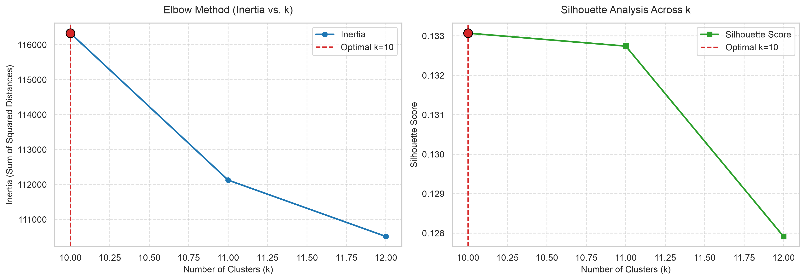
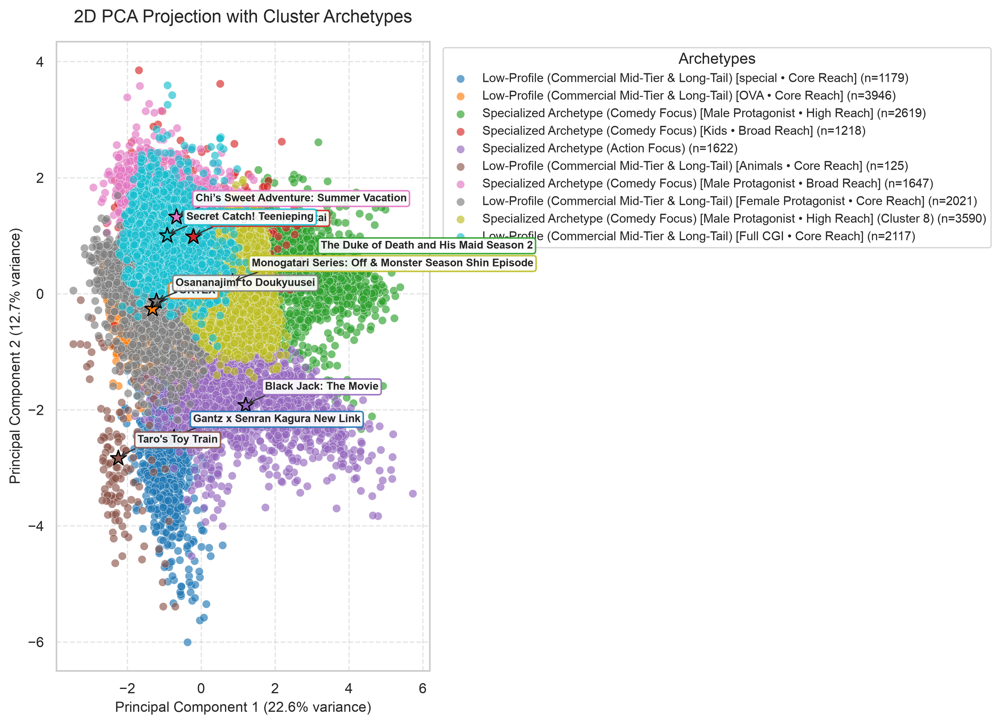
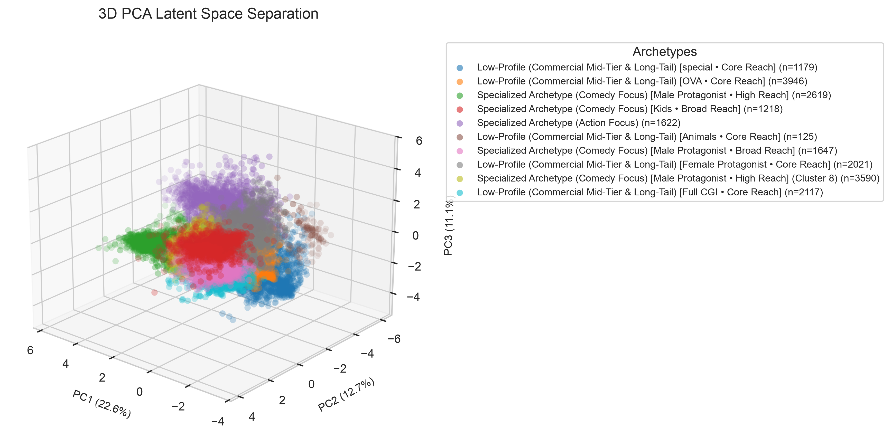
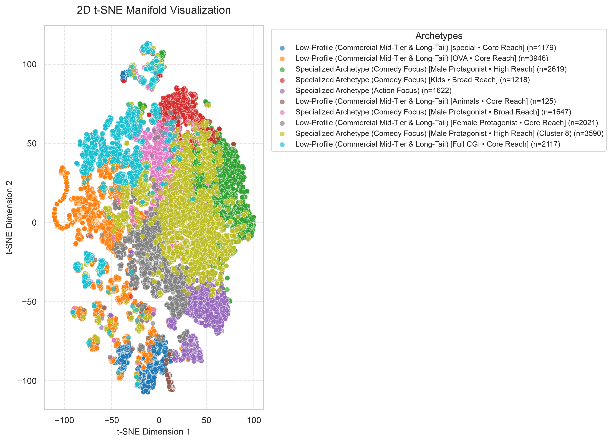
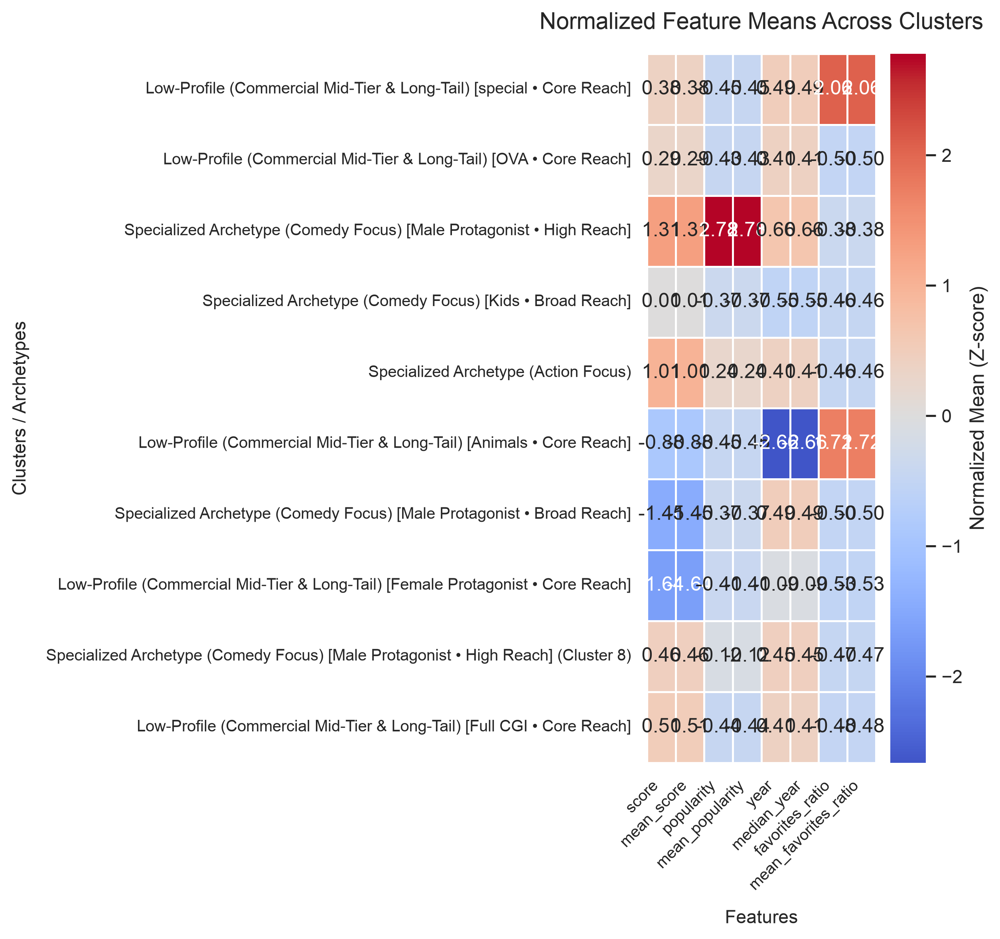

# Anime Unsupervised Clustering & Empirical Archetype Report

## Executive Summary
- **Dataset Analyzed**: 20,084 anime entries (Current SQLite Local Database: 20,084 titles)
- **Data Architecture**: Dual-storage engine (SQLite `data/anime_catalog.db` with auto-sync to `data/raw_anime_data.json`)
- **Multi-Source Support**: Primary AniList GraphQL API + Secondary Kitsu JSON:API fallback with polite rate-limiting
- **Feature Dimensionality**: 77 engineered features (Continuous standard, categorical one-hot, multi-label genres, and TF-IDF tags)
- **K-Means Cluster Count ($k$)**: 10
- **DBSCAN Density Structure**: 2 dense core clusters, 36 structural noise/outlier points

---

## 1. Optimal Number of Clusters & Silhouette Diagnostics
Cluster cohesion and separation were evaluated across candidate cluster counts $k \in [10, 12]$:

| $k$ (Clusters) | Inertia ($WCSS$) | Silhouette Score | Archetype Alignment Status |
|:--------------:|:----------------:|:----------------:|:--------------------------:|
| 10 | 116331.67 | 0.1331 | Selected |
| 11 | 112126.75 | 0.1327 |  |
| 12 | 110513.50 | 0.1279 |  |

> [!NOTE]
> **Adaptive Cluster Scaling & Parsimony Tradeoff**: The candidate search window scales dynamically with catalog volume. Penalized silhouette scoring prevents premature saturation at coarse $k$ while rewarding relative inertia reduction, allowing subtle sub-genres and era distinctions to surface as the database grows.

---

## 2. Cluster Profiles Summary Table
Quantitative feature means and dominant categorical traits across each discovered cluster archetype:

|   cluster_id | archetype                                                                        |   size |   score |   mean_score |   popularity |   mean_popularity |   year |   median_year |   favorites_ratio |   mean_favorites_ratio | top_genres                | top_tags                                           |
|--------------|----------------------------------------------------------------------------------|--------|---------|--------------|--------------|-------------------|--------|---------------|-------------------|------------------------|---------------------------|----------------------------------------------------|
|            0 | Low-Profile (Commercial Mid-Tier & Long-Tail) [special • Core Reach]             |   1179 |   66.49 |        66.49 |       249.00 |            248.98 |   2014 |       2014.00 |              0.23 |                   0.23 | Animation, Special, Ona   | special, ONA, music                                |
|            1 | Low-Profile (Commercial Mid-Tier & Long-Tail) [OVA • Core Reach]                 |   3946 |   65.83 |        65.83 |       701.20 |            701.21 |   2012 |       2012.00 |              0.01 |                   0.01 | Animation, Special, Ova   | special, OVA, Female Protagonist                   |
|            2 | Specialized Archetype (Comedy Focus) [Male Protagonist • High Reach]             |   2619 |   73.19 |        73.19 |     94218.00 |          94218.04 |   2018 |       2018.00 |              0.02 |                   0.02 | Comedy, Action, Drama     | Male Protagonist, Female Protagonist, Heterosexual |
|            3 | Specialized Archetype (Comedy Focus) [Kids • Broad Reach]                        |   1218 |   63.75 |        63.75 |      2630.10 |           2630.09 |   1989 |       1989.00 |              0.01 |                   0.01 | Comedy, Adventure, Sci-Fi | Male Protagonist, Kids, Female Protagonist         |
|            4 | Specialized Archetype (Action Focus)                                             |   1622 |   71.05 |        71.05 |     20415.10 |          20415.06 |   2012 |       2012.00 |              0.01 |                   0.01 | Action, Drama, Adventure  | Male Protagonist, Female Protagonist, movie        |
|            5 | Low-Profile (Commercial Mid-Tier & Long-Tail) [Animals • Core Reach]             |    125 |   57.35 |        57.35 |       286.40 |            286.36 |   1938 |       1938.00 |              0.20 |                   0.20 | Animation, Movie, Special | movie, Achromatic, Animals                         |
|            6 | Specialized Archetype (Comedy Focus) [Male Protagonist • Broad Reach]            |   1647 |   53.23 |        53.23 |      2632.50 |           2632.50 |   2014 |       2014.00 |              0.01 |                   0.01 | Comedy, Fantasy, Action   | Female Protagonist, Kids, Male Protagonist         |
|            7 | Low-Profile (Commercial Mid-Tier & Long-Tail) [Female Protagonist • Core Reach]  |   2021 |   51.81 |        51.81 |      1357.40 |           1357.40 |   2000 |       2000.00 |              0.01 |                   0.01 | Hentai, Comedy, Action    | Female Protagonist, Male Protagonist, Rape         |
|            8 | Specialized Archetype (Comedy Focus) [Male Protagonist • High Reach] (Cluster 8) |   3590 |   67.01 |        67.01 |      9866.80 |           9866.84 |   2013 |       2013.00 |              0.01 |                   0.01 | Comedy, Action, Fantasy   | Male Protagonist, Female Protagonist, School       |
|            9 | Low-Profile (Commercial Mid-Tier & Long-Tail) [Full CGI • Core Reach]            |   2117 |   67.42 |        67.42 |       403.80 |            403.85 |   2012 |       2012.00 |              0.01 |                   0.01 | Fantasy, Action, Comedy   | Full CGI, ONA, TV                                  |

---

## 3. Detailed Empirical Archetype Findings
### Cluster 0: Low-Profile (Commercial Mid-Tier & Long-Tail) [special • Core Reach]
- **Cluster Size**: 1179 titles (5.9% of catalog)
- **Median Release Year**: 2014
- **Mean Average Score**: 66.49 / 100
- **Mean Popularity**: 249 members
- **Favorites-to-Popularity Ratio**: 0.2254
- **Dominant Genres**: Animation, Special, Ona
- **Key Thematic Tags**: special, ONA, music
- **Representative Exemplar Titles**: Dirty Pair Flash 3, Solty Rei Special, UFO Princess Valkyrie: Special, Toriko x One Piece Collabo Special, Shukufuku no Campanella Specials

### Cluster 1: Low-Profile (Commercial Mid-Tier & Long-Tail) [OVA • Core Reach]
- **Cluster Size**: 3946 titles (19.6% of catalog)
- **Median Release Year**: 2012
- **Mean Average Score**: 65.83 / 100
- **Mean Popularity**: 701 members
- **Favorites-to-Popularity Ratio**: 0.0115
- **Dominant Genres**: Animation, Special, Ova
- **Key Thematic Tags**: special, OVA, Female Protagonist
- **Representative Exemplar Titles**: My Hero Academia Movie 2: Heroes Rising Epilogue Plus, Naruto Narutimate Hero 3: Tsuini Gekitotsu! Jounin vs. Genin!! Musabetsu Dairansen taikai Kaisai!!, My Ordinary Life Episode 0, Saiki Kusuo OkaerinaPSI Special, Gintama: Shiroyasha Koutan

### Cluster 2: Specialized Archetype (Comedy Focus) [Male Protagonist • High Reach]
- **Cluster Size**: 2619 titles (13.0% of catalog)
- **Median Release Year**: 2018
- **Mean Average Score**: 73.19 / 100
- **Mean Popularity**: 94,218 members
- **Favorites-to-Popularity Ratio**: 0.0214
- **Dominant Genres**: Comedy, Action, Drama
- **Key Thematic Tags**: Male Protagonist, Female Protagonist, Heterosexual
- **Representative Exemplar Titles**: Attack on Titan, Demon Slayer: Kimetsu no Yaiba, JUJUTSU KAISEN, Death Note, My Hero Academia

### Cluster 3: Specialized Archetype (Comedy Focus) [Kids • Broad Reach]
- **Cluster Size**: 1218 titles (6.1% of catalog)
- **Median Release Year**: 1989
- **Mean Average Score**: 63.75 / 100
- **Mean Popularity**: 2,630 members
- **Favorites-to-Popularity Ratio**: 0.0145
- **Dominant Genres**: Comedy, Adventure, Sci-Fi
- **Key Thematic Tags**: Male Protagonist, Kids, Female Protagonist
- **Representative Exemplar Titles**: Mobile Suit Gundam, Tomorrow's Joe, Saint Seiya: Knights of the Zodiac, Fist of the North Star, Lupin the 3rd

### Cluster 4: Specialized Archetype (Action Focus)
- **Cluster Size**: 1622 titles (8.1% of catalog)
- **Median Release Year**: 2012
- **Mean Average Score**: 71.05 / 100
- **Mean Popularity**: 20,415 members
- **Favorites-to-Popularity Ratio**: 0.0147
- **Dominant Genres**: Action, Drama, Adventure
- **Key Thematic Tags**: Male Protagonist, Female Protagonist, movie
- **Representative Exemplar Titles**: A Silent Voice, Your Name., Demon Slayer -Kimetsu no Yaiba- The Movie: Mugen Train, Spirited Away, JUJUTSU KAISEN 0

### Cluster 5: Low-Profile (Commercial Mid-Tier & Long-Tail) [Animals • Core Reach]
- **Cluster Size**: 125 titles (0.6% of catalog)
- **Median Release Year**: 1938
- **Mean Average Score**: 57.35 / 100
- **Mean Popularity**: 286 members
- **Favorites-to-Popularity Ratio**: 0.1975
- **Dominant Genres**: Animation, Movie, Special
- **Key Thematic Tags**: movie, Achromatic, Animals
- **Representative Exemplar Titles**: Momotaro, Sacred Sailors, Katsudou Shashin, Kumo to Tulip, The Dull Sword, Momotarou no Umiwashi

### Cluster 6: Specialized Archetype (Comedy Focus) [Male Protagonist • Broad Reach]
- **Cluster Size**: 1647 titles (8.2% of catalog)
- **Median Release Year**: 2014
- **Mean Average Score**: 53.23 / 100
- **Mean Popularity**: 2,632 members
- **Favorites-to-Popularity Ratio**: 0.0114
- **Dominant Genres**: Comedy, Fantasy, Action
- **Key Thematic Tags**: Female Protagonist, Kids, Male Protagonist
- **Representative Exemplar Titles**: King's Game, The Lost Village, My Life as Inukai-san’s Dog, Netsuzou Trap -NTR-, Pupa

### Cluster 7: Low-Profile (Commercial Mid-Tier & Long-Tail) [Female Protagonist • Core Reach]
- **Cluster Size**: 2021 titles (10.1% of catalog)
- **Median Release Year**: 2000
- **Mean Average Score**: 51.81 / 100
- **Mean Popularity**: 1,357 members
- **Favorites-to-Popularity Ratio**: 0.0083
- **Dominant Genres**: Hentai, Comedy, Action
- **Key Thematic Tags**: Female Protagonist, Male Protagonist, Rape
- **Representative Exemplar Titles**: Dragon Ball Z: Bio-Broly, Boku no Pico, Chika Gentou Gekiga: Shoujo Tsubaki, Mars of Destruction, Dragon Ball: Curse of the Blood Rubies

### Cluster 8: Specialized Archetype (Comedy Focus) [Male Protagonist • High Reach] (Cluster 8)
- **Cluster Size**: 3590 titles (17.9% of catalog)
- **Median Release Year**: 2013
- **Mean Average Score**: 67.01 / 100
- **Mean Popularity**: 9,867 members
- **Favorites-to-Popularity Ratio**: 0.0135
- **Dominant Genres**: Comedy, Action, Fantasy
- **Key Thematic Tags**: Male Protagonist, Female Protagonist, School
- **Representative Exemplar Titles**: Attack on Titan Season 3 Specials, Corpse Party, Hunter x Hunter: Greed Island, Diabolik Lovers, Boku no Hero Academia: Sukue! Kyuujo Kunren!

### Cluster 9: Low-Profile (Commercial Mid-Tier & Long-Tail) [Full CGI • Core Reach]
- **Cluster Size**: 2117 titles (10.5% of catalog)
- **Median Release Year**: 2012
- **Mean Average Score**: 67.42 / 100
- **Mean Popularity**: 404 members
- **Favorites-to-Popularity Ratio**: 0.0128
- **Dominant Genres**: Fantasy, Action, Comedy
- **Key Thematic Tags**: Full CGI, ONA, TV
- **Representative Exemplar Titles**: Adventure Time Season 3, Adventure Time Season 8, Adventure Time Season 4, Adventure Time Season 5, Adventure Time Season 6

---

## 4. Latent Space Visualizations & Manifold Projections
High-dimensional representations projected via PCA (2D & 3D) and t-SNE (2D):

### Elbow Silhouette

### Pca 2D

### Pca 3D

### Tsne 2D

### Cluster Heatmap

---

## 5. Incremental Database Architecture & Fallback Strategy
1. **SQLite Persistent Database (`data/anime_catalog.db`)**: Deduplicates incoming anime by canonical ID (`anilist:{id}`, `kitsu:{id}`), tracking pagination state across runs.
2. **Rate Limit Throttling**: Implements configurable polite delays (`--rate-delay`) to prevent API rate limits or IP bans during large catalog harvests.
3. **Multi-Source Failover**: Queries AniList GraphQL endpoint by default. If AniList is rate-limited, unreachable, or returns insufficient records, queries Kitsu JSON:API, normalizing attributes into the standard schema.
4. **Offline Portability**: The database automatically exports full state to `data/raw_anime_data.json` for offline demonstration.

---
*Report auto-generated by the Antigravity Data Science Pipeline.*