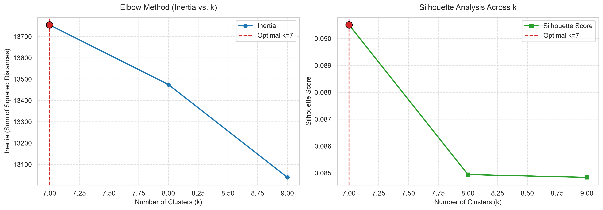
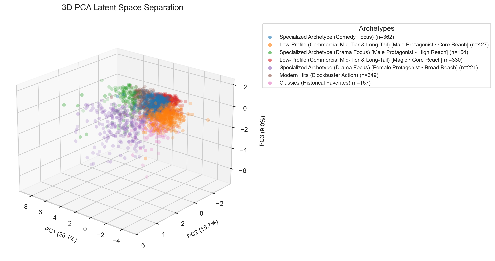
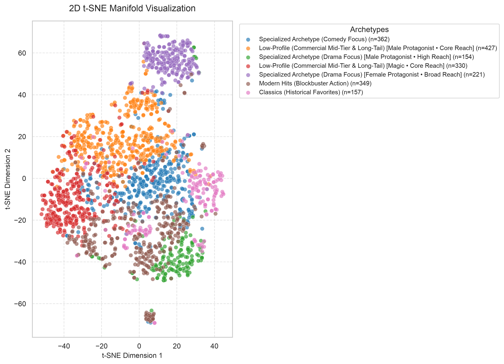

# Anime Unsupervised Clustering & Empirical Archetype Report

## Executive Summary
- **Dataset Analyzed**: 2,000 anime entries (Current SQLite Local Database: 40,654 titles)
- **Data Architecture**: Dual-storage engine (SQLite `data/anime_catalog.db` with auto-sync to `data/raw_anime_data.json`)
- **Multi-Source Support**: Primary AniList GraphQL API + Secondary Kitsu JSON:API fallback with polite rate-limiting
- **Feature Dimensionality**: 75 engineered features (Continuous standard, categorical one-hot, multi-label genres, and TF-IDF tags)
- **K-Means Cluster Count ($k$)**: 7
- **DBSCAN Density Structure**: 5 dense core clusters, 126 structural noise/outlier points

---

## 1. Optimal Number of Clusters & Silhouette Diagnostics
Cluster cohesion and separation were evaluated across candidate cluster counts $k \in [7, 9]$:

| $k$ (Clusters) | Inertia ($WCSS$) | Silhouette Score | Archetype Alignment Status |
|:--------------:|:----------------:|:----------------:|:--------------------------:|
| 7 | 13754.65 | 0.0905 | Selected |
| 8 | 13474.49 | 0.0849 |  |
| 9 | 13039.31 | 0.0848 |  |

> [!NOTE]
> **Adaptive Cluster Scaling & Parsimony Tradeoff**: The candidate search window scales dynamically with catalog volume. Penalized silhouette scoring prevents premature saturation at coarse $k$ while rewarding relative inertia reduction, allowing subtle sub-genres and era distinctions to surface as the database grows.

---

## 2. Cluster Profiles Summary Table
Quantitative feature means and dominant categorical traits across each discovered cluster archetype:

|   cluster_id | archetype                                                                     |   size |   score |   mean_score |   popularity |   mean_popularity |   year |   median_year |   favorites_ratio |   mean_favorites_ratio | top_genres                     | top_tags                                           |
|--------------|-------------------------------------------------------------------------------|--------|---------|--------------|--------------|-------------------|--------|---------------|-------------------|------------------------|--------------------------------|----------------------------------------------------|
|            0 | Specialized Archetype (Comedy Focus)                                          |    362 |   75.88 |        75.88 |     69700.40 |          69700.44 |   2022 |       2022.00 |              0.02 |                   0.02 | Comedy, Slice of Life, Romance | Male Protagonist, Female Protagonist, Heterosexual |
|            1 | Low-Profile (Commercial Mid-Tier & Long-Tail) [Male Protagonist • Core Reach] |    427 |   67.15 |        67.15 |     60814.60 |          60814.60 |   2014 |       2014.00 |              0.01 |                   0.01 | Comedy, Romance, Action        | Male Protagonist, School, Female Protagonist       |
|            2 | Specialized Archetype (Drama Focus) [Male Protagonist • High Reach]           |    154 |   83.16 |        83.16 |    382181.50 |         382181.47 |   2016 |       2016.00 |              0.05 |                   0.05 | Drama, Action, Comedy          | Male Protagonist, Tragedy, Ensemble Cast           |
|            3 | Low-Profile (Commercial Mid-Tier & Long-Tail) [Magic • Core Reach]            |    330 |   66.27 |        66.27 |     80775.30 |          80775.27 |   2022 |       2022.00 |              0.02 |                   0.02 | Fantasy, Action, Adventure     | Male Protagonist, Magic, Swordplay                 |
|            4 | Specialized Archetype (Drama Focus) [Female Protagonist • Broad Reach]        |    221 |   77.29 |        77.29 |    100688.00 |         100687.97 |   2015 |       2015.00 |              0.02 |                   0.02 | Drama, Action, Fantasy         | Male Protagonist, Female Protagonist, Tragedy      |
|            5 | Modern Hits (Blockbuster Action)                                              |    349 |   76.82 |        76.82 |    223646.50 |         223646.47 |   2018 |       2018.00 |              0.02 |                   0.02 | Action, Comedy, Drama          | Male Protagonist, Heterosexual, Tragedy            |
|            6 | Classics (Historical Favorites)                                               |    157 |   76.60 |        76.60 |     81527.80 |          81527.84 |   2006 |       2006.00 |              0.03 |                   0.03 | Action, Drama, Comedy          | Male Protagonist, Ensemble Cast, Heterosexual      |

---

## 3. Detailed Empirical Archetype Findings
### Cluster 0: Specialized Archetype (Comedy Focus)
- **Cluster Size**: 362 titles (18.1% of catalog)
- **Median Release Year**: 2022
- **Mean Average Score**: 75.88 / 100
- **Mean Popularity**: 69,700 members
- **Favorites-to-Popularity Ratio**: 0.0221
- **Dominant Genres**: Comedy, Slice of Life, Romance
- **Key Thematic Tags**: Male Protagonist, Female Protagonist, Heterosexual
- **Representative Exemplar Titles**: Haikyu!! 3rd Season, My Hero Academia Season 5, Uzaki-chan Wants to Hang Out!, Bottom-Tier Character Tomozaki, BEASTARS Season 2

### Cluster 1: Low-Profile (Commercial Mid-Tier & Long-Tail) [Male Protagonist • Core Reach]
- **Cluster Size**: 427 titles (21.3% of catalog)
- **Median Release Year**: 2014
- **Mean Average Score**: 67.15 / 100
- **Mean Popularity**: 60,815 members
- **Favorites-to-Popularity Ratio**: 0.0102
- **Dominant Genres**: Comedy, Romance, Action
- **Key Thematic Tags**: Male Protagonist, School, Female Protagonist
- **Representative Exemplar Titles**: Haganai, BTOOOM!, My First Girlfriend is a Gal, Oreimo, Blood Lad

### Cluster 2: Specialized Archetype (Drama Focus) [Male Protagonist • High Reach]
- **Cluster Size**: 154 titles (7.7% of catalog)
- **Median Release Year**: 2016
- **Mean Average Score**: 83.16 / 100
- **Mean Popularity**: 382,182 members
- **Favorites-to-Popularity Ratio**: 0.0549
- **Dominant Genres**: Drama, Action, Comedy
- **Key Thematic Tags**: Male Protagonist, Tragedy, Ensemble Cast
- **Representative Exemplar Titles**: Attack on Titan, Demon Slayer: Kimetsu no Yaiba, JUJUTSU KAISEN, Death Note, My Hero Academia

### Cluster 3: Low-Profile (Commercial Mid-Tier & Long-Tail) [Magic • Core Reach]
- **Cluster Size**: 330 titles (16.5% of catalog)
- **Median Release Year**: 2022
- **Mean Average Score**: 66.27 / 100
- **Mean Popularity**: 80,775 members
- **Favorites-to-Popularity Ratio**: 0.0155
- **Dominant Genres**: Fantasy, Action, Adventure
- **Key Thematic Tags**: Male Protagonist, Magic, Swordplay
- **Representative Exemplar Titles**: The Promised Neverland Season 2, Boruto: Naruto Next Generations, How NOT to Summon a Demon Lord, The Seven Deadly Sins: Imperial Wrath of the Gods, Eromanga Sensei

### Cluster 4: Specialized Archetype (Drama Focus) [Female Protagonist • Broad Reach]
- **Cluster Size**: 221 titles (11.1% of catalog)
- **Median Release Year**: 2015
- **Mean Average Score**: 77.29 / 100
- **Mean Popularity**: 100,688 members
- **Favorites-to-Popularity Ratio**: 0.0215
- **Dominant Genres**: Drama, Action, Fantasy
- **Key Thematic Tags**: Male Protagonist, Female Protagonist, Tragedy
- **Representative Exemplar Titles**: Demon Slayer -Kimetsu no Yaiba- The Movie: Mugen Train, Spirited Away, JUJUTSU KAISEN 0, Your Name., I Want to Eat Your Pancreas

### Cluster 5: Modern Hits (Blockbuster Action)
- **Cluster Size**: 349 titles (17.4% of catalog)
- **Median Release Year**: 2018
- **Mean Average Score**: 76.82 / 100
- **Mean Popularity**: 223,646 members
- **Favorites-to-Popularity Ratio**: 0.0242
- **Dominant Genres**: Action, Comedy, Drama
- **Key Thematic Tags**: Male Protagonist, Heterosexual, Tragedy
- **Representative Exemplar Titles**: Sword Art Online, My Hero Academia Season 2, Attack on Titan, My Hero Academia Season 3, My Hero Academia

### Cluster 6: Classics (Historical Favorites)
- **Cluster Size**: 157 titles (7.8% of catalog)
- **Median Release Year**: 2006
- **Mean Average Score**: 76.60 / 100
- **Mean Popularity**: 81,528 members
- **Favorites-to-Popularity Ratio**: 0.0262
- **Dominant Genres**: Action, Drama, Comedy
- **Key Thematic Tags**: Male Protagonist, Ensemble Cast, Heterosexual
- **Representative Exemplar Titles**: Fullmetal Alchemist, A Certain Magical Index, Fate/stay night, When They Cry, Darker than Black

---

## 4. Latent Space Visualizations & Manifold Projections
High-dimensional representations projected via PCA (2D & 3D) and t-SNE (2D):

### Elbow Silhouette

### Pca 2D

### Pca 3D

### Tsne 2D

### Cluster Heatmap

---

## 5. Incremental Database Architecture & Fallback Strategy
1. **SQLite Persistent Database (`data/anime_catalog.db`)**: Deduplicates incoming anime by canonical ID (`anilist:{id}`, `kitsu:{id}`), tracking pagination state across runs.
2. **Rate Limit Throttling**: Implements configurable polite delays (`--rate-delay`) to prevent API rate limits or IP bans during large catalog harvests.
3. **Multi-Source Failover**: Queries AniList GraphQL endpoint by default. If AniList is rate-limited, unreachable, or returns insufficient records, queries Kitsu JSON:API, normalizing attributes into the standard schema.
4. **Offline Portability**: The database automatically exports full state to `data/raw_anime_data.json` for offline demonstration.

---
*Report auto-generated by the Antigravity Data Science Pipeline.*