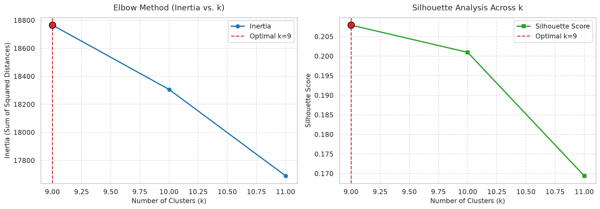
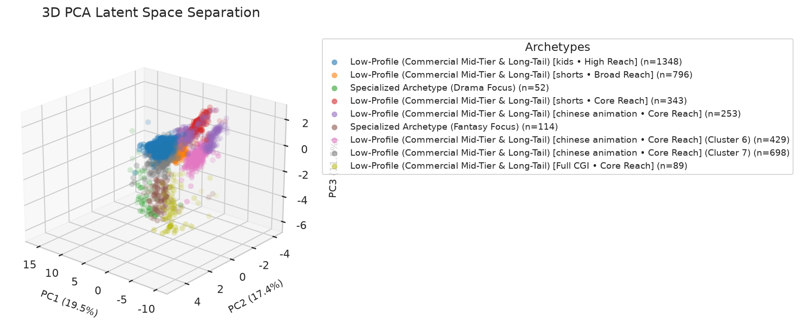
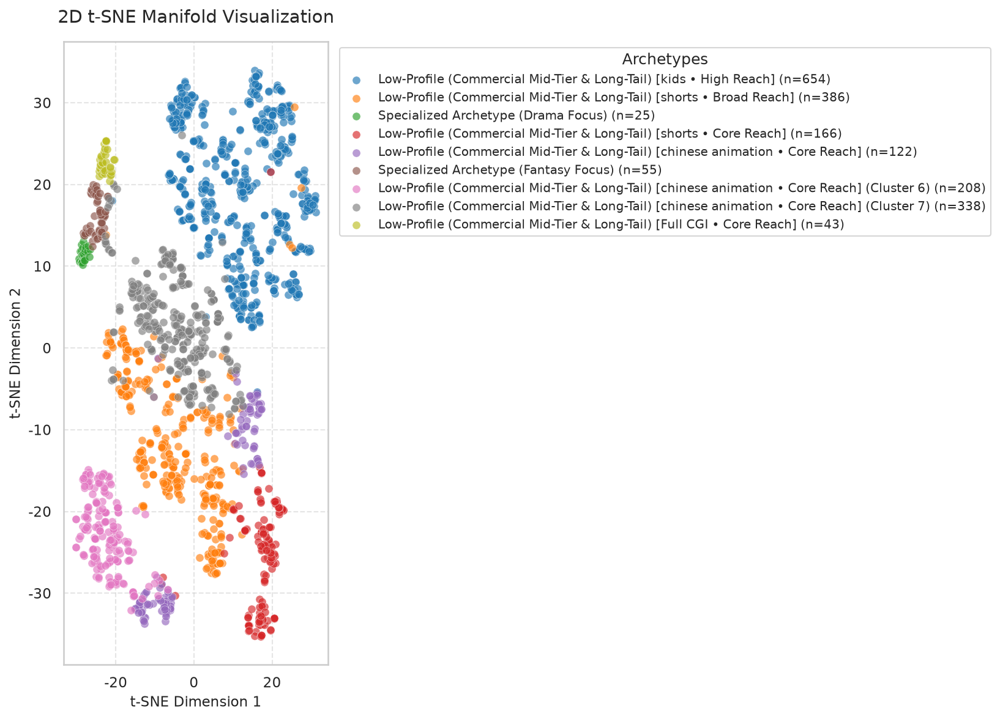

# Anime Unsupervised Clustering & Empirical Archetype Report

## Executive Summary
- **Dataset Analyzed**: 4,122 anime entries (Current SQLite Local Database: 40,654 titles)
- **Data Architecture**: Dual-storage engine (SQLite `data/anime_catalog.db` with auto-sync to `data/raw_anime_data.json`)
- **Multi-Source Support**: Primary AniList GraphQL API + Secondary Kitsu JSON:API fallback with polite rate-limiting
- **Feature Dimensionality**: 76 engineered features (Continuous standard, categorical one-hot, multi-label genres, and TF-IDF tags)
- **K-Means Cluster Count ($k$)**: 9
- **DBSCAN Density Structure**: 5 dense core clusters, 103 structural noise/outlier points

---

## 1. Optimal Number of Clusters & Silhouette Diagnostics
Cluster cohesion and separation were evaluated across candidate cluster counts $k \in [9, 11]$:

| $k$ (Clusters) | Inertia ($WCSS$) | Silhouette Score | Archetype Alignment Status |
|:--------------:|:----------------:|:----------------:|:--------------------------:|
| 9 | 18765.38 | 0.2079 | Selected |
| 10 | 18306.32 | 0.2010 |  |
| 11 | 17689.35 | 0.1694 |  |

> [!NOTE]
> **Adaptive Cluster Scaling & Parsimony Tradeoff**: The candidate search window scales dynamically with catalog volume. Penalized silhouette scoring prevents premature saturation at coarse $k$ while rewarding relative inertia reduction, allowing subtle sub-genres and era distinctions to surface as the database grows.

---

## 2. Cluster Profiles Summary Table
Quantitative feature means and dominant categorical traits across each discovered cluster archetype:

|   cluster_id | archetype                                                                                  |   size |   score |   mean_score |   popularity |   mean_popularity |   year |   median_year |   favorites_ratio |   mean_favorites_ratio | top_genres                 | top_tags                                   |
|--------------|--------------------------------------------------------------------------------------------|--------|---------|--------------|--------------|-------------------|--------|---------------|-------------------|------------------------|----------------------------|--------------------------------------------|
|            0 | Low-Profile (Commercial Mid-Tier & Long-Tail) [kids • High Reach]                          |   1348 |   64.99 |        64.99 |      1000.50 |           1000.51 |   2014 |       2014.00 |              0.05 |                   0.05 | Tv, Fantasy, Comedy        | kids, chinese animation, family friendly   |
|            1 | Low-Profile (Commercial Mid-Tier & Long-Tail) [shorts • Broad Reach]                       |    796 |   65.33 |        65.33 |      1000.50 |           1000.51 |   2018 |       2018.00 |              0.05 |                   0.05 | Fantasy, Action, Drama     | chinese animation, shorts, fantasy         |
|            2 | Specialized Archetype (Drama Focus)                                                        |     52 |   77.62 |        77.62 |     77115.60 |          77115.60 |   2016 |       2016.00 |              0.03 |                   0.03 | Drama, Action, Fantasy     | Male Protagonist, Historical, Tragedy      |
|            3 | Low-Profile (Commercial Mid-Tier & Long-Tail) [shorts • Core Reach]                        |    343 |   64.15 |        64.15 |      1000.00 |           1000.00 |   1981 |       1981.00 |              0.05 |                   0.05 | Movie, Fantasy, Drama      | chinese animation, kids, shorts            |
|            4 | Low-Profile (Commercial Mid-Tier & Long-Tail) [chinese animation • Core Reach]             |    253 |   43.73 |        43.73 |      1000.00 |           1000.00 |   2010 |       2010.00 |              0.05 |                   0.05 | Action, Adventure, Comedy  | chinese animation, action, adventure       |
|            5 | Specialized Archetype (Fantasy Focus)                                                      |    114 |   69.92 |        69.92 |      2772.60 |           2772.64 |   2016 |       2016.00 |              0.03 |                   0.02 | Fantasy, Action, Adventure | Full CGI, Cultivation, Male Protagonist    |
|            6 | Low-Profile (Commercial Mid-Tier & Long-Tail) [chinese animation • Core Reach] (Cluster 6) |    429 |   64.30 |        64.30 |       998.60 |            998.59 |   2016 |       2016.00 |              0.05 |                   0.05 | Adventure, Fantasy, Action | chinese animation, adventure, kids         |
|            7 | Low-Profile (Commercial Mid-Tier & Long-Tail) [chinese animation • Core Reach] (Cluster 7) |    698 |   66.04 |        66.04 |      1000.30 |           1000.26 |   2019 |       2019.00 |              0.05 |                   0.05 | Fantasy, Comedy, Action    | chinese animation, short episodes, fantasy |
|            8 | Low-Profile (Commercial Mid-Tier & Long-Tail) [Full CGI • Core Reach]                      |     89 |   62.01 |        62.01 |       254.70 |            254.69 |   2016 |       2016.00 |              0.01 |                   0.01 | Adventure, Action, Fantasy | Full CGI, Wuxia, Historical                |

---

## 3. Detailed Empirical Archetype Findings
### Cluster 0: Low-Profile (Commercial Mid-Tier & Long-Tail) [kids • High Reach]
- **Cluster Size**: 1348 titles (32.7% of catalog)
- **Median Release Year**: 2014
- **Mean Average Score**: 64.99 / 100
- **Mean Popularity**: 1,000 members
- **Favorites-to-Popularity Ratio**: 0.0500
- **Dominant Genres**: Tv, Fantasy, Comedy
- **Key Thematic Tags**: kids, chinese animation, family friendly
- **Representative Exemplar Titles**: Tunshi Xingkong 4, 12生肖全家福網絡世界歷險, 12生肖全家福的神奇世界, 23号牛乃糖, 26个秘密

### Cluster 1: Low-Profile (Commercial Mid-Tier & Long-Tail) [shorts • Broad Reach]
- **Cluster Size**: 796 titles (19.3% of catalog)
- **Median Release Year**: 2018
- **Mean Average Score**: 65.33 / 100
- **Mean Popularity**: 1,000 members
- **Favorites-to-Popularity Ratio**: 0.0500
- **Dominant Genres**: Fantasy, Action, Drama
- **Key Thematic Tags**: chinese animation, shorts, fantasy
- **Representative Exemplar Titles**: Dou Po Cangqiong: Yuanqi, Douluo Dalu: Shuang Shen Zhi Zhan, I=Fantasy, (Mi)Liu, (OO)

### Cluster 2: Specialized Archetype (Drama Focus)
- **Cluster Size**: 52 titles (1.3% of catalog)
- **Median Release Year**: 2016
- **Mean Average Score**: 77.62 / 100
- **Mean Popularity**: 77,116 members
- **Favorites-to-Popularity Ratio**: 0.0320
- **Dominant Genres**: Drama, Action, Fantasy
- **Key Thematic Tags**: Male Protagonist, Historical, Tragedy
- **Representative Exemplar Titles**: Your lie in April, Blue Exorcist, The Apothecary Diaries, The Rising of the Shield Hero Season 2, Dragon Ball

### Cluster 3: Low-Profile (Commercial Mid-Tier & Long-Tail) [shorts • Core Reach]
- **Cluster Size**: 343 titles (8.3% of catalog)
- **Median Release Year**: 1981
- **Mean Average Score**: 64.15 / 100
- **Mean Popularity**: 1,000 members
- **Favorites-to-Popularity Ratio**: 0.0500
- **Dominant Genres**: Movie, Fantasy, Drama
- **Key Thematic Tags**: chinese animation, kids, shorts
- **Representative Exemplar Titles**: A Long He Lili, Sad Drowning, 安宁, 八百鞭子, Ba Luobo

### Cluster 4: Low-Profile (Commercial Mid-Tier & Long-Tail) [chinese animation • Core Reach]
- **Cluster Size**: 253 titles (6.1% of catalog)
- **Median Release Year**: 2010
- **Mean Average Score**: 43.73 / 100
- **Mean Popularity**: 1,000 members
- **Favorites-to-Popularity Ratio**: 0.0500
- **Dominant Genres**: Action, Adventure, Comedy
- **Key Thematic Tags**: chinese animation, action, adventure
- **Representative Exemplar Titles**: 15 Children Space Adventure, 2005 Space Odyssey, 77 Danui Bimil, '84 Taekwon V, Asi Yu Xiao Liangdang

### Cluster 5: Specialized Archetype (Fantasy Focus)
- **Cluster Size**: 114 titles (2.8% of catalog)
- **Median Release Year**: 2016
- **Mean Average Score**: 69.92 / 100
- **Mean Popularity**: 2,773 members
- **Favorites-to-Popularity Ratio**: 0.0250
- **Dominant Genres**: Fantasy, Action, Adventure
- **Key Thematic Tags**: Full CGI, Cultivation, Male Protagonist
- **Representative Exemplar Titles**: Dragon Ball: Mystical Adventure, Noblesse: The Beginning of Destruction, Kusuriya no Hitorigoto 3rd Season Part 2, Yi Ren Zhi Xia 3, A Herbivorous Dragon of 5,000 Years Gets Unfairly Villainized

### Cluster 6: Low-Profile (Commercial Mid-Tier & Long-Tail) [chinese animation • Core Reach] (Cluster 6)
- **Cluster Size**: 429 titles (10.4% of catalog)
- **Median Release Year**: 2016
- **Mean Average Score**: 64.30 / 100
- **Mean Popularity**: 999 members
- **Favorites-to-Popularity Ratio**: 0.0499
- **Dominant Genres**: Adventure, Fantasy, Action
- **Key Thematic Tags**: chinese animation, adventure, kids
- **Representative Exemplar Titles**: Thunderbolt Fantasy - Bewitching Melody of the West, 81号农场之保卫麦咭, 81 Hao Nongchang: Fengkuang De Mai Ji, A Tang Qiyu, Agi Gongnyong Dooly: Eoreum Byeol Daemoheom

### Cluster 7: Low-Profile (Commercial Mid-Tier & Long-Tail) [chinese animation • Core Reach] (Cluster 7)
- **Cluster Size**: 698 titles (16.9% of catalog)
- **Median Release Year**: 2019
- **Mean Average Score**: 66.04 / 100
- **Mean Popularity**: 1,000 members
- **Favorites-to-Popularity Ratio**: 0.0501
- **Dominant Genres**: Fantasy, Comedy, Action
- **Key Thematic Tags**: chinese animation, short episodes, fantasy
- **Representative Exemplar Titles**: Soul Land 2: The Peerless Tang Clan, Tunshi Xingkong 2, Dou Po Cangqiong: San Nian Zhi Yue, Jade Dynasty, Cang Yuan Tu

### Cluster 8: Low-Profile (Commercial Mid-Tier & Long-Tail) [Full CGI • Core Reach]
- **Cluster Size**: 89 titles (2.2% of catalog)
- **Median Release Year**: 2016
- **Mean Average Score**: 62.01 / 100
- **Mean Popularity**: 255 members
- **Favorites-to-Popularity Ratio**: 0.0145
- **Dominant Genres**: Adventure, Action, Fantasy
- **Key Thematic Tags**: Full CGI, Wuxia, Historical
- **Representative Exemplar Titles**: Wangpai Yushi, Tianbao Fuyao Lu 3, Fanren Xiu Xian Zhuan: Xinghai Feichi Prologue, Hua Jianghu: Buliang Ren, Bai Yao Pu: Luoyang Pian

---

## 4. Latent Space Visualizations & Manifold Projections
High-dimensional representations projected via PCA (2D & 3D) and t-SNE (2D):

### Elbow Silhouette

### Pca 2D

### Pca 3D

### Tsne 2D

### Cluster Heatmap

---

## 5. Incremental Database Architecture & Fallback Strategy
1. **SQLite Persistent Database (`data/anime_catalog.db`)**: Deduplicates incoming anime by canonical ID (`anilist:{id}`, `kitsu:{id}`), tracking pagination state across runs.
2. **Rate Limit Throttling**: Implements configurable polite delays (`--rate-delay`) to prevent API rate limits or IP bans during large catalog harvests.
3. **Multi-Source Failover**: Queries AniList GraphQL endpoint by default. If AniList is rate-limited, unreachable, or returns insufficient records, queries Kitsu JSON:API, normalizing attributes into the standard schema.
4. **Offline Portability**: The database automatically exports full state to `data/raw_anime_data.json` for offline demonstration.

---
*Report auto-generated by the Antigravity Data Science Pipeline.*