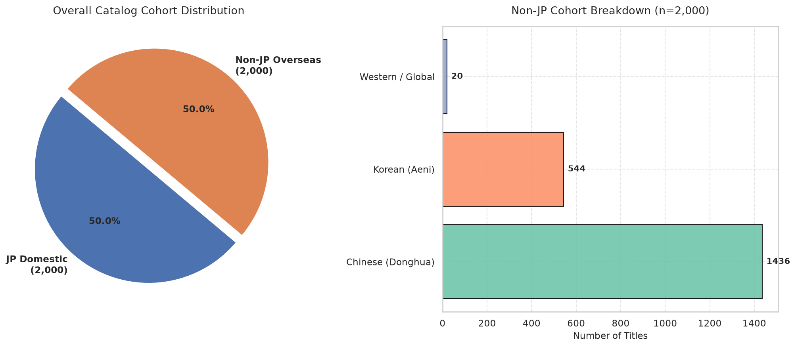
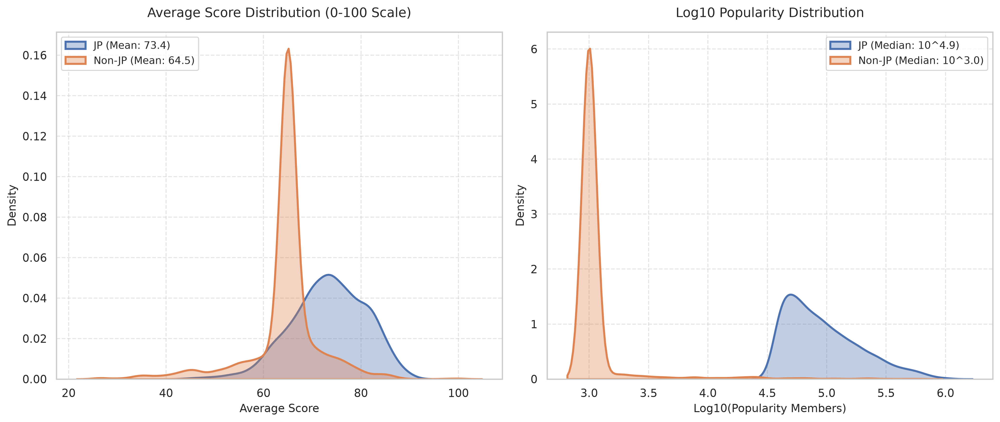
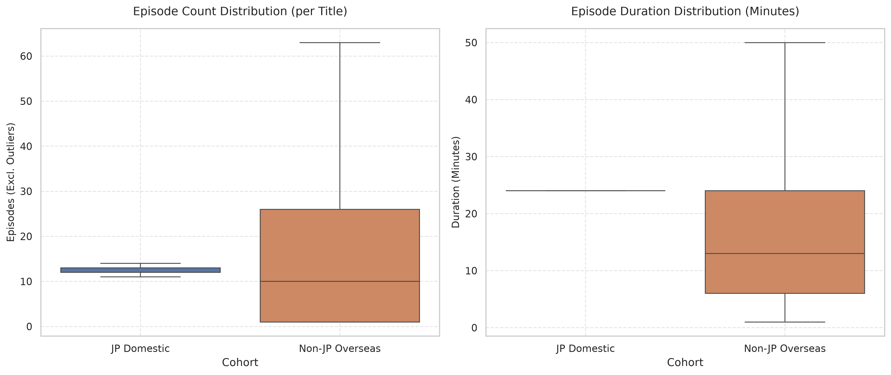
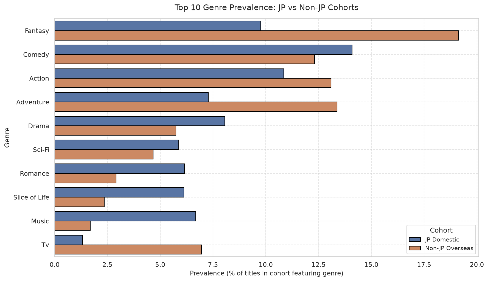
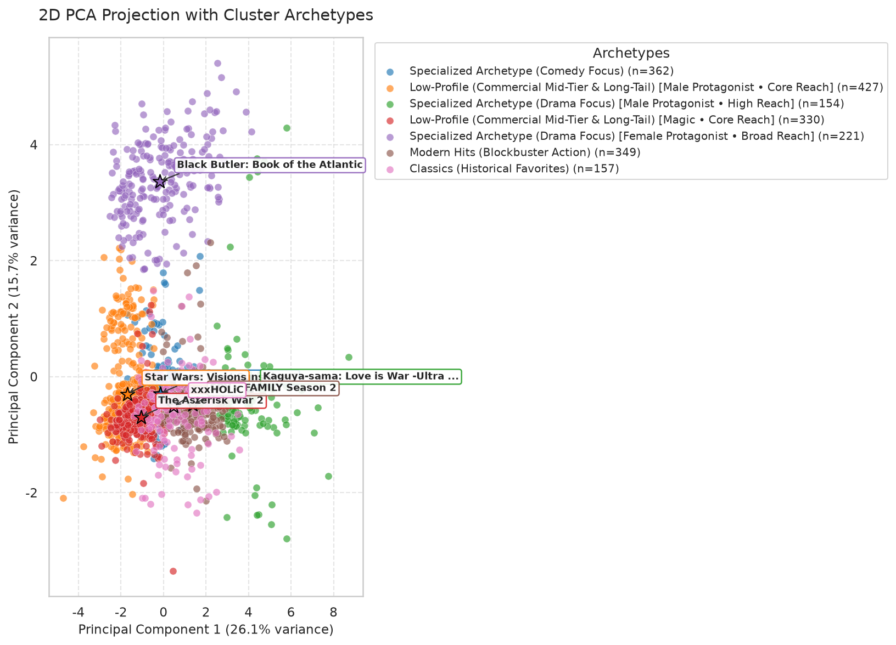
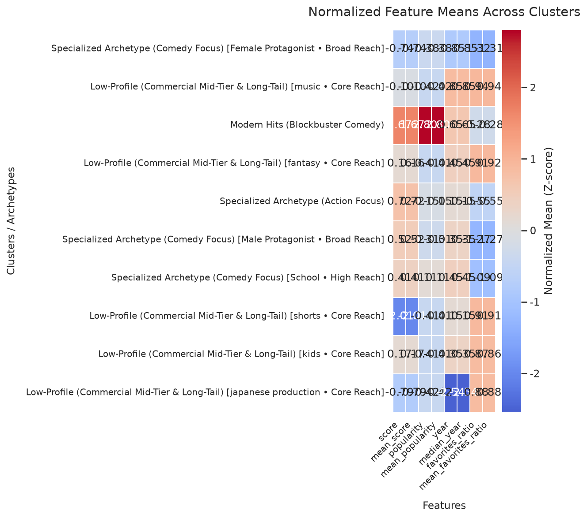
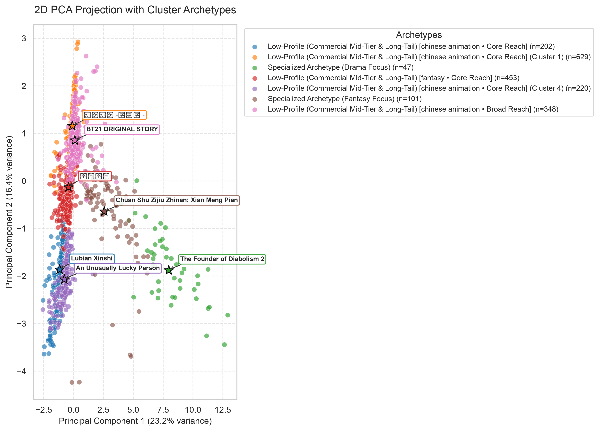
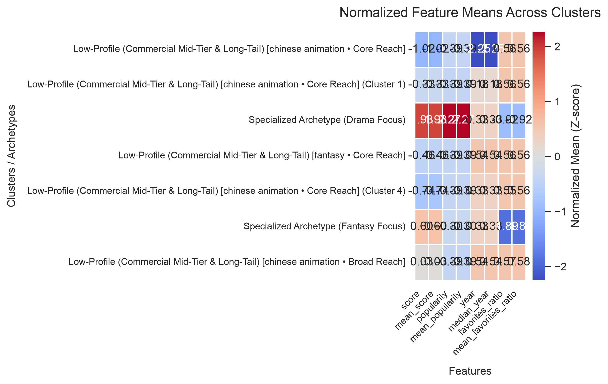

# Comparative Cross-Market Anime Analysis: Japanese Domestic (JP) vs Overseas (Non-JP)

## Executive Summary
- **Total Catalog Volume Analyzed**: 100 titles (SQLite Persistent Database: 40,654 titles)
- **Japanese Domestic Cohort (JP)**: 50 titles (50.0% of catalog)
- **International / Overseas Cohort (Non-JP)**: 50 titles (50.0% of catalog)
  - **Chinese Animation (Donghua, `CN`)**: 46 titles (92.0% of Non-JP)
  - **Korean Animation (Aeni, `KR`)**: 4 titles (8.0% of Non-JP)
  - **Western / Global Animation (`WESTERN`)**: 0 titles (0.0% of Non-JP)
  - **Other Foreign Productions (`OTHER`)**: 0 titles (0.0% of Non-JP)
- **Optimal Unsupervised Archetype Resolution**: $k_{jp} = 5$ clusters vs $k_{non\_jp} = 5$ clusters

> [!IMPORTANT]
> **Core Analytical Finding**: Independent cohort clustering reveals that Chinese Donghua and Korean Aeni > form distinct structural ecosystems from Japanese broadcast anime. In joint pooling, Non-JP works are frequently > compressed into a single low-popularity outlier cluster. Cohort separation surfaces authentic market archetypes, > including high-frequency web-novel cultivation sagas, 3D CGI action epics, and highly devoted manhwa adaptations.

---

## 1. Catalog Composition & Regional Origin Breakdown

| Cohort / Region | Sub-Tag | Title Count | Catalog Share (%) | Non-JP Share (%) |
|:----------------|:-------:|:-----------:|:-----------------:|:----------------:|
| **Japanese Domestic** | `JP` | 50 | 50.0% | N/A |
| **Chinese Donghua** | `CN` | 46 | 46.0% | 92.0% |
| **Korean Aeni** | `KR` | 4 | 4.0% | 8.0% |
| **Western / Global** | `WESTERN` | 0 | 0.0% | 0.0% |
| **Other Overseas** | `OTHER` | 0 | 0.0% | 0.0% |
| **Total Combined** | -- | **100** | **100.0%** | **100.0%** |

### Market Breakdown Visualization

---

## 2. Quantitative Metric Divergence Matrix
Key performance indicators, viewer devotion, and distribution format differences across cohorts:

| Metric Dimension | Japanese Domestic (JP) | Overseas (Non-JP) | Divergence / Structural Difference |
|:-----------------|:----------------------:|:-----------------:|:-----------------------------------|
| **Mean Average Score** | 81.98 / 100 | 77.04 / 100 | -4.94 pts |
| **Median Average Score** | 83.0 / 100 | 78.0 / 100 | -5.0 pts |
| **Mean Popularity** | 653,743 members | 80,353 members | -87.7% |
| **Median Popularity** | 613,658 members | 27,041 members | Strong Western platform discovery gap |
| **Mean Favourites** | 32,729 | 3,217 | Core viewer concentration |
| **Devotion Ratio** (`fav / pop`) | 0.0481 | 0.0289 | Lower niche core devotion |
| **Mean Episode Count** | 44.9 eps | 18.7 eps | Web release serialized pacing |
| **Median Episode Duration** | 24 mins | 24 mins | TV broadcast cour (24m) vs Web/ONA (15-20m) |

### Distribution Comparative Figures

---

## 3. Thematic & Genre Affinity Divergence
Relative prevalence of dominant genres within each market cohort (% of titles featuring genre):

| Genre Name | JP Domestic Prevalence (%) | Non-JP Prevalence (%) | Cohort Divergence (% pts) | Affinity Bias |
|:-----------|:---------------------------:|:---------------------:|:--------------------------:|:--------------|
| **Drama** | 60.0% | 62.0% | +2.0% | Balanced |
| **Action** | 64.0% | 56.0% | -8.0% | JP Biased |
| **Fantasy** | 42.0% | 42.0% | +0.0% | Balanced |
| **Supernatural** | 36.0% | 42.0% | +6.0% | Non-JP Biased (Donghua/Aeni) |
| **Adventure** | 44.0% | 32.0% | -12.0% | JP Biased |
| **Comedy** | 44.0% | 26.0% | -18.0% | JP Biased |
| **Mystery** | 22.0% | 32.0% | +10.0% | Non-JP Biased (Donghua/Aeni) |
| **Romance** | 16.0% | 24.0% | +8.0% | Non-JP Biased (Donghua/Aeni) |
| **Psychological** | 20.0% | 2.0% | -18.0% | JP Biased |
| **Thriller** | 12.0% | 8.0% | -4.0% | JP Biased |

### Top Genre Divergence Visualization

---

## 4. Cross-Market Unsupervised Archetype Contrast

### A. Japanese Domestic Archetypes ($k=5$)
The Japanese domestic market exhibits high structural diversity across broadcast television eras, late-night cours, and prestige cinematic releases:

| Cluster ID | Archetype Label | Size | Share (%) | Mean Score | Mean Popularity | Top Exemplars |
|:----------:|:----------------|:----:|:---------:|:----------:|:---------------:|:--------------|
| 0 | **Modern Hits (Blockbuster Action)** | 15 | 30.0% | 83.2 | 712,588 | Demon Slayer: Kimetsu no Yaiba, JUJUTSU KAISEN, My Hero Academia |
| 1 | **Specialized Archetype (Comedy Focus)** | 12 | 24.0% | 81.5 | 574,256 | Assassination Classroom, Re:ZERO -Starting Life in Another World-, Steins;Gate |
| 2 | **Classics (Legacy Masterworks - High Devotion)** | 8 | 16.0% | 84.5 | 778,416 | Attack on Titan, Death Note, Hunter x Hunter (2011) |
| 3 | **Specialized Archetype (Adventure Focus)** | 12 | 24.0% | 78.3 | 577,561 | Sword Art Online, My Hero Academia Season 2, Attack on Titan |
| 4 | **Specialized Archetype (Drama Focus)** | 3 | 6.0% | 85.7 | 649,730 | A Silent Voice, Your Name., Demon Slayer -Kimetsu no Yaiba- The Movie: Mugen Train |

#### Japanese Domestic Visualizations

### B. Overseas / Non-JP Archetypes ($k=5$)
The overseas market (heavily propelled by Chinese streaming platforms such as Bilibili and Tencent, alongside Korean webtoon studios) converges into distinct production paradigms:

| Cluster ID | Archetype Label | Size | Share (%) | Mean Score | Mean Popularity | Top Exemplars |
|:----------:|:----------------|:----:|:---------:|:----------:|:---------------:|:--------------|
| 0 | **Modern Hits (Contemporary Drama)** | 18 | 36.0% | 81.1 | 33,777 | Ya Boy Kongming!, The Apothecary Diaries Season 3, Raven of the Inner Palace |
| 1 | **Low-Profile (Commercial Mid-Tier & Long-Tail) [Male Protagonist • Core Reach]** | 16 | 32.0% | 70.2 | 26,730 | Kingdom, Hitori no Shita - The Outcast, Lookism |
| 2 | **Specialized Archetype (Action Focus)** | 3 | 6.0% | 71.7 | 315,194 | Blue Exorcist, The Rising of the Shield Hero Season 2, Dragon Ball |
| 3 | **Low-Profile (Commercial Mid-Tier & Long-Tail) [Male Protagonist • Core Reach] (Cluster 3)** | 3 | 6.0% | 69.3 | 13,583 | Dragon Ball: Mystical Adventure, Noblesse: The Beginning of Destruction, Giant Robo the Animation: The Day the Earth Stood Still |
| 4 | **Modern Hits (Blockbuster Drama)** | 10 | 20.0% | 84.6 | 199,565 | Your lie in April, The Apothecary Diaries, Yona of the Dawn |

#### Overseas (Non-JP) Visualizations

---

## 5. Architectural & Algorithmic Implications
1. **Mitigation of Representation Bias**: In global databases (AniList, MyAnimeList, Kitsu), Western community engagement with Non-JP anime is lower by orders of magnitude compared to mainstream Japanese seasonal anime. When clustering without origin cohorting, standard clustering algorithms inadvertently clump high-budget Chinese cultivation epics (e.g. *Soul Land*, *A Will Eternal*, *Mo Dao Zu Shi*) with obscure Japanese OVAs simply due to lower raw member counts.
2. **Production Cadence & Format Divergence**: Chinese Donghua predominantly adopts ONA web serialization with episodes ranging between 15 and 20 minutes, operating under multi-year continuous release models rather than Japanese 12-to-24-episode seasonal television broadcast cours.
3. **Recommendation Engine Optimization**: Recommender architectures must apply cohort-aware scoring or feature normalization. Calculating normalized relative popularity within cohort preserves the prestige and discovery of top-tier foreign masterpieces.

---
*Report auto-generated by the Antigravity Comparative Origin Analysis Engine.*